 <link rel="stylesheet" href="https://hi2272.github.io/StyleMD.css">
  

# Kurzanleitung ISpartan auf dem IPad
([Methan](#1-methan) | [Ethen: π-Orbital](#2-π-orbital-beim-ethen) | [E/Z-Isomerie](#3-e--und-z-isomerie-beim-buta-2-en) | [Konformere](#4-konformere-beim-12-dichlorethan) | [Elektronendichteverteilung](#5-elektronendichteverteilung) )

 

## 1. Methan
### Sketch-Modus  
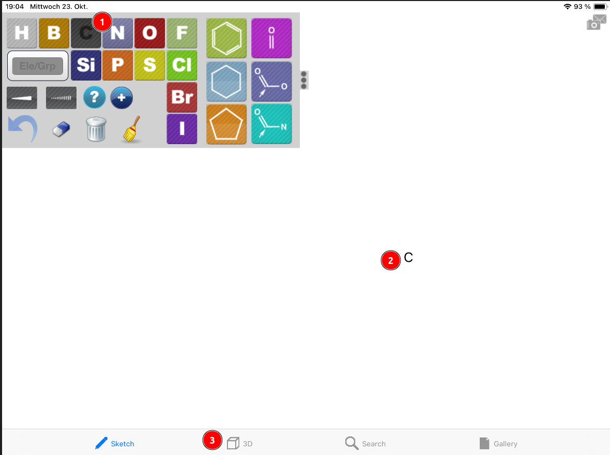  

1. Wähle ein **C**-Atom zum Zeichnen aus. 
2. **Tippe doppelt** auf die Zeichenfläche, um ein einzelnes C-Atom zu zeichnen. Die H-Atome werden später automatisch ergänzt
3. Wechsele in den 3D-Modus
### 3D-Modus
Bevor du dein Molekül im dreidimensionalen Raum näher untersuchen kannst, musst du ISparten zuerst die nötigen Daten aus einer Datenbank laden.
Klicke hierzu auf das Download-Symbol (1):
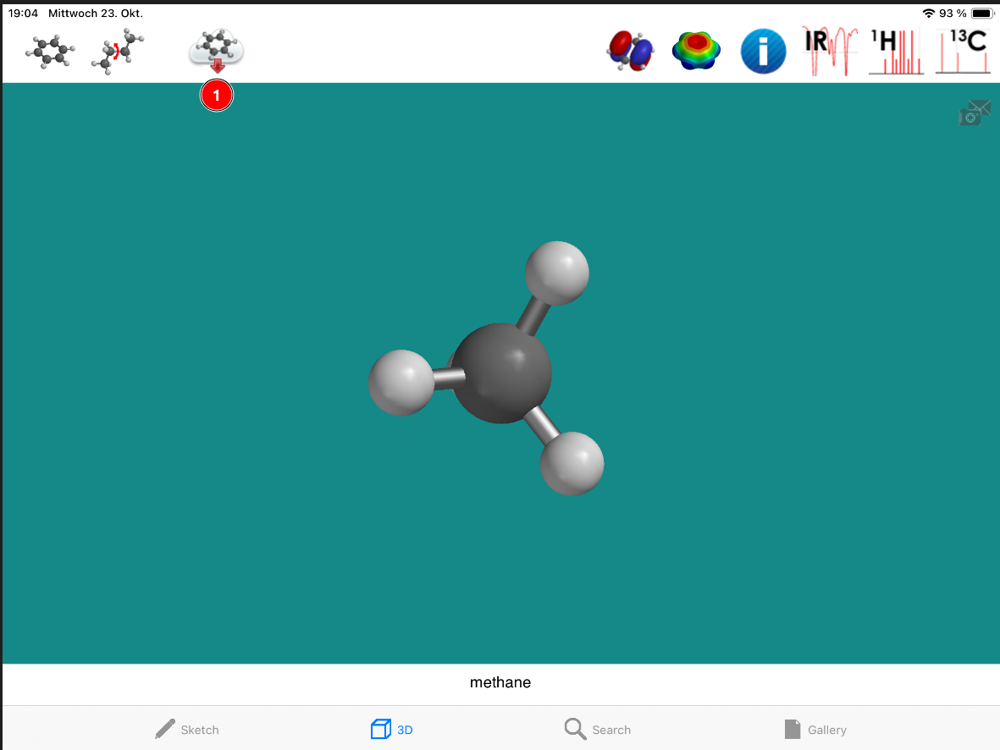  

### Teilladungen, Bindungslängen, Bindungswinkel 
Klicke auf das Info-Symbol (1):
### 1. Teiladungen:   
   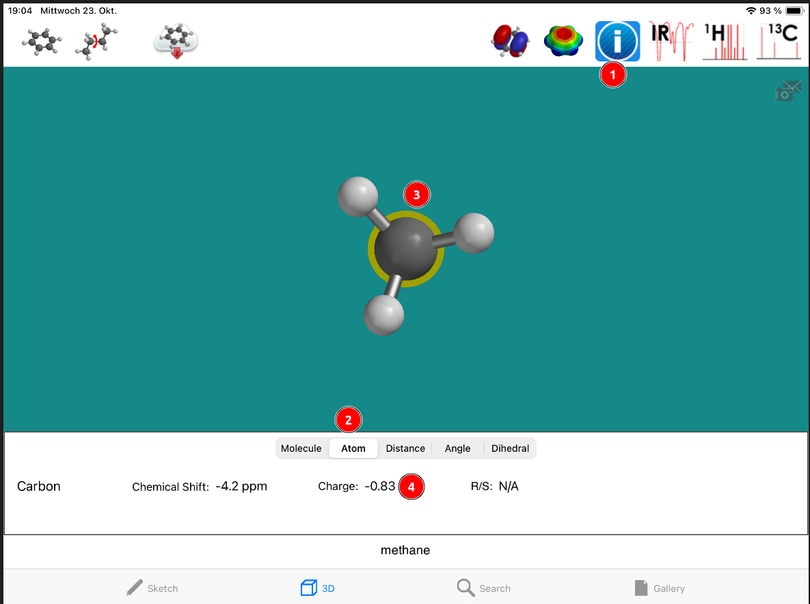   
Wähle **Atom** (2) und klicke einzelne Atome an (3), um dir ihre Teilladung (Charge) (4) anzeigen zu lassen.
Die chemische Verschiebung (chemical shift) ist eine Angabe aus der Spektroskopie, die in der Schule nicht benötigt wird.  
### 2. Bindungslänge:  
Wähle **Distance** und klicke zwei Atome an, um dir eine Bindungslänge anzeigen zu lassen.  
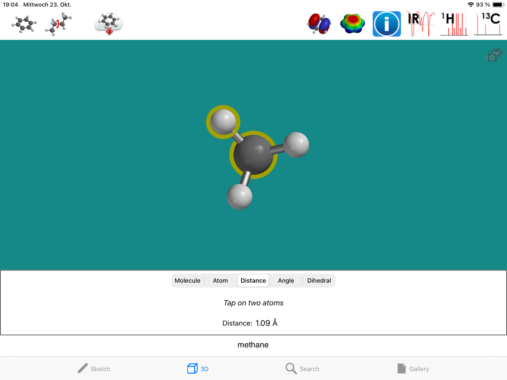  
### 3. Bindungswinkel:  
Wähle **Angle** und klicke drei Atome an, um dir den Bindungswinkel zwischen den Atomen anzeigen zu lassen:  
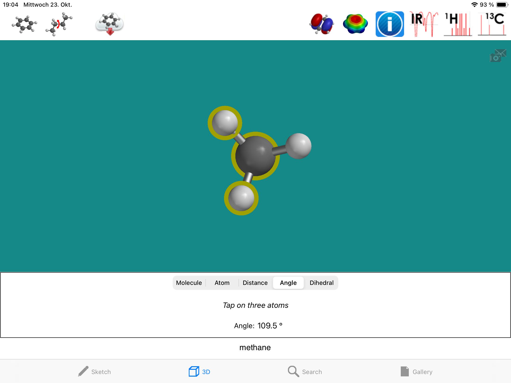   

**Achtung**: Sinnvolle Winkel erhältst du nur, wenn du die Atome in der Reihenfolge *Links, Mitte, Rechts* oder *Rechts,Mitte,Links* anklickst.
#### Ladungsverteilung auf der Oberfläche
Durch einen Klick auf das Elektronendichte-Symbol (1) wird die Elektrondendichte auf der Oberfläche des Moleküls dargestellt:  
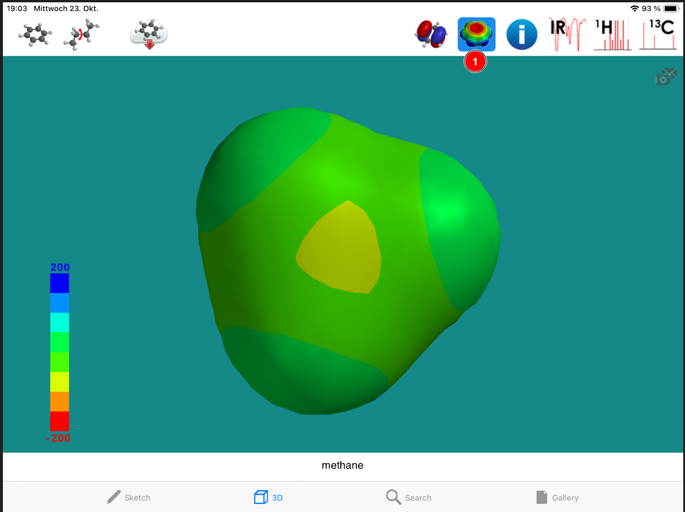  
Methan ist ein offensichtlich unpolar gebaut.  

## 2. π-Orbital beim Ethen
### Sketch-Modus
1. Wähle ein **C**-Atom zum Zeichnen an. 
2. Ziehe eine Linie in die Zeichenfläche - damit hast du ein Ethan-Molekül gezeichnet.  
   Ziehe noch einmal vom Start- bis zum Endpunkt dieser Linie. Damit fügst du die Doppelbindung für das Ethen-Molekül ein:   
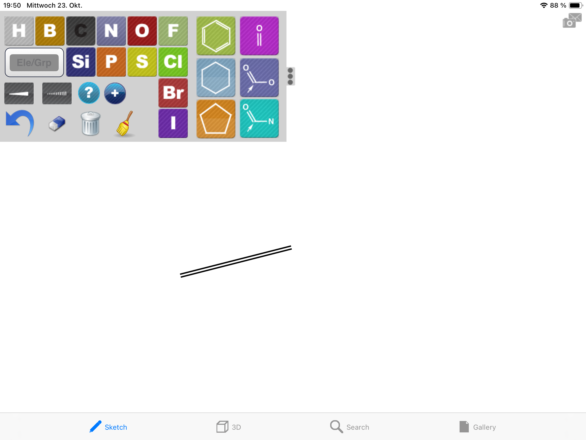  
3. Über den Rückpfeil oder den Papierkorb kannst du Fehler korrigieren.  
Um eine Bindung wegzuradieren, musst du den Radierer anwählen und doppelt auf die Bindung tippen.
4. Wechsele in den 3D-Modus

### Darstellung des π-Molekülorbitals
Die bindenden π-Molekülorbital ist das höchste besetzte Orbital im Ethen-Molekül (Highest Occupied Orbital = HOMO).  
1. Lade die Daten zum Molekül herunter.
2. Klicke auf das Orbital-Werkzeug.
   Links werden die Energieniveaus der Molekül-Orbitale angezeigt:  
   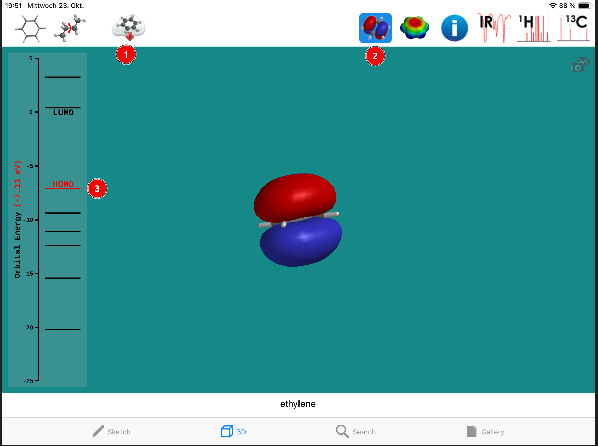  
3. Klicke die Linie des HOMO an, um das bindende π-Orbital darzustellen.  
Die anderen Energieniveaus kennzeichnen Orbitale, die aus den Berechnungen der MO-Theorie stammen. Sie können nicht mit den Orbitalen aus der Hybridisierungs-Theorie in Einklang gebracht werden.  
## 3. E- und Z-Isomerie beim Buta-2-en
Beim Übergang vom Sketch- und den 3D-Modus rechnet ISpartan automatisch das energetisch gürnstigere Isomer.  
Dieser Sketch wird daher zum E-Buta-2-en (trans-butene):  
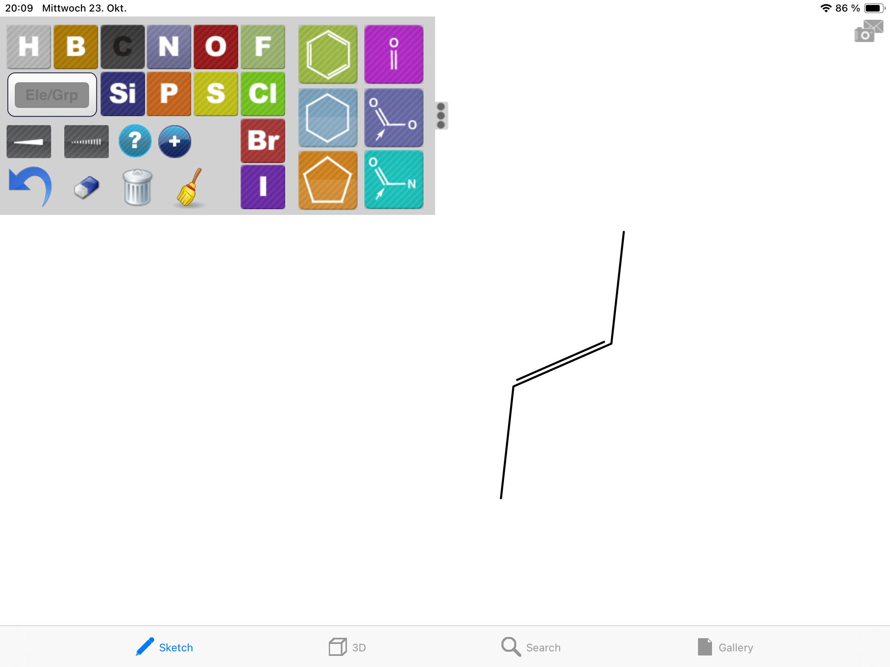   
Die Z (cis)-Form kann erzeugt werden, wenn im Sketch mit den Keil-Formen (1) oder (2) angeben wird, dass beide Bindungen auf die gleiche Seite zeigen:  
  
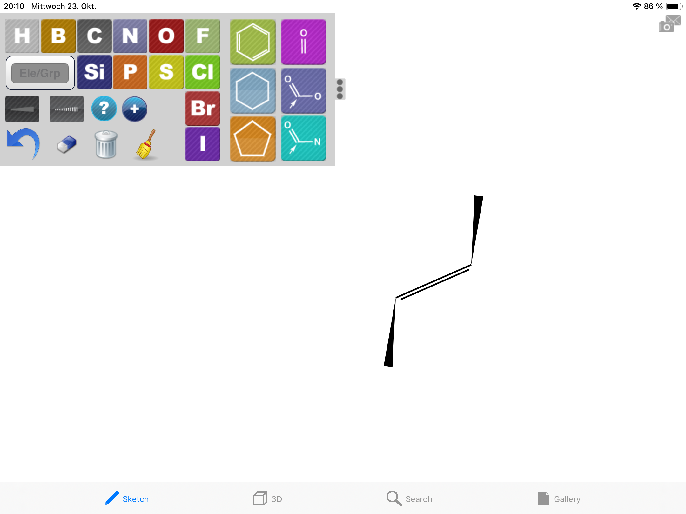  

Leider kann im 3D-Modus nicht zwischen der E- und der Z-Form hin- und hergewechselt werden.
## 4. Konformere beim 1,2-Dichlorethan
### Sketch-Modus
1. Zeichne ein Ethan-Molekül.
2. Wähle das Cl-Atom.
3. Ziehe vom linken und vom rechten C-Atom eine Bindung zum Cl-Atom weg:  
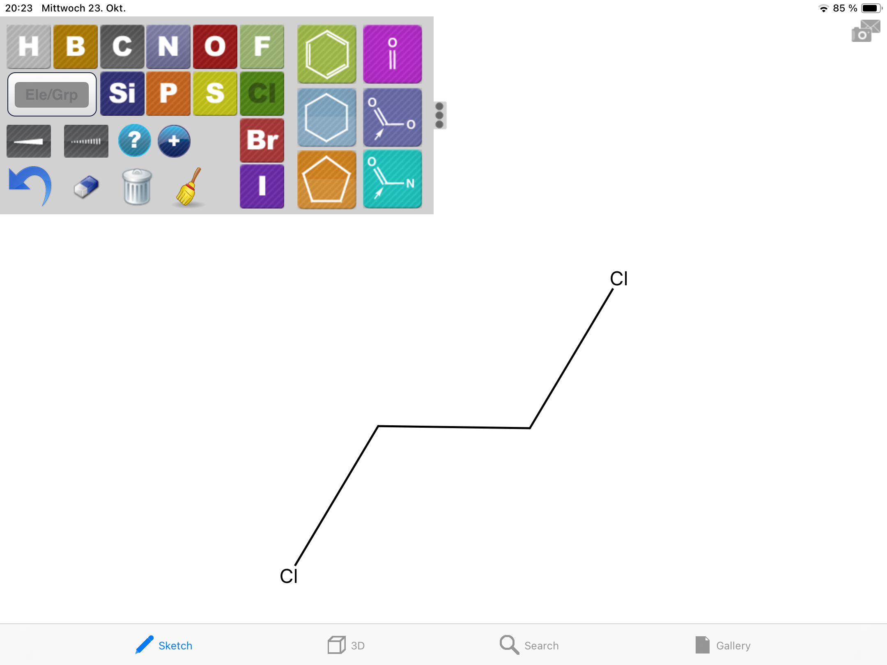  
4. Wechsele in den 3D-Modus
### Konformere

1. Klicke auf das Konformers-Werkzeug.   
Das System sucht jetzt nach stabilen räumlichen Ausrichtungen der Atome und findet in diesem Fall ein stabiles und ein metastabiles Konformer.  
2. Wechsele zwischen den beiden Konformeren durch Klicken auf die Energieniveaus:  
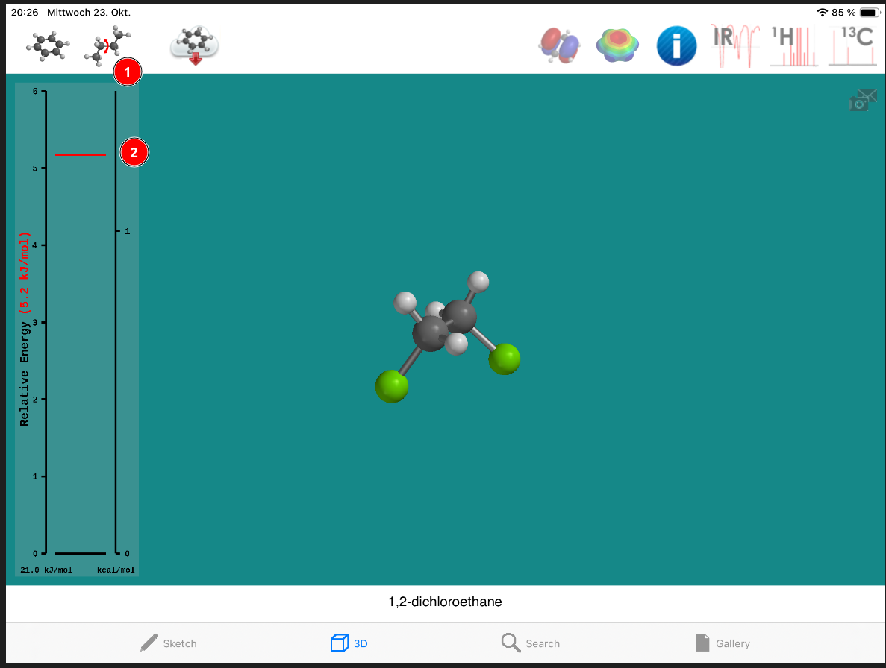  
Bei größeren Molekülen findet das System eine Vielzahl metastabiler Konformere:  
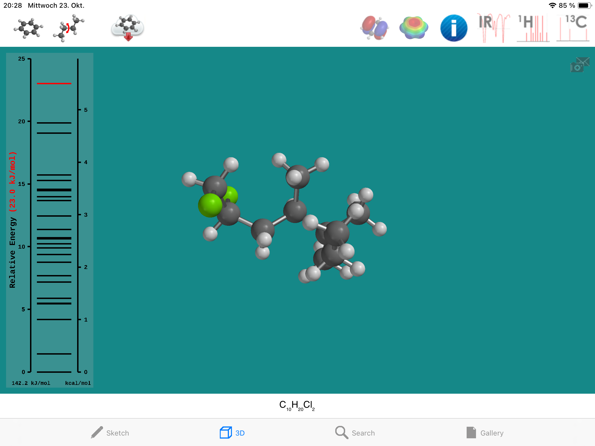

## 5. Elektronendichteverteilung
### Sketch-Modus
Zeichne ein Ethanol-Molekül:  
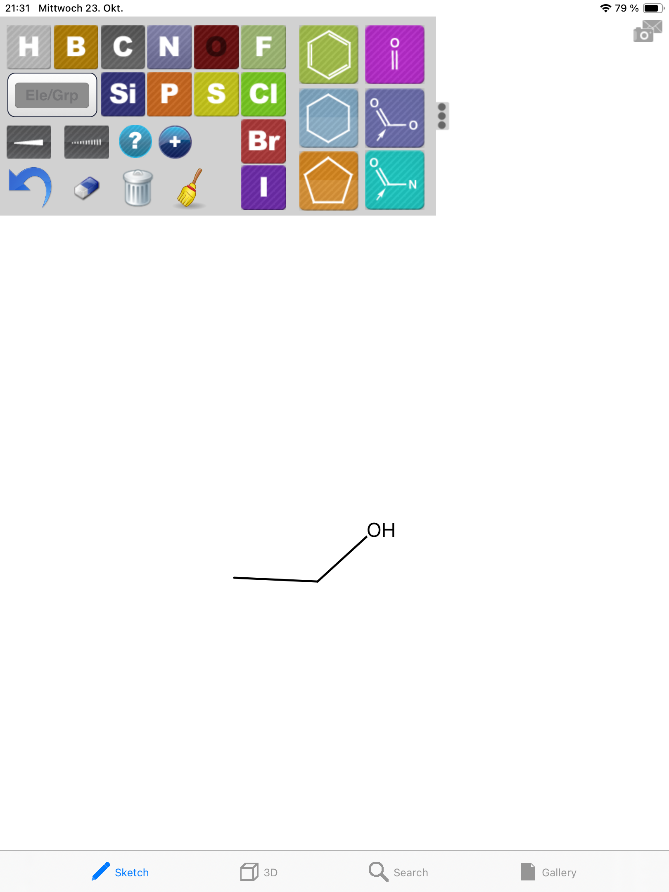  
Wechsele in den 3D-Modus.  
### Elektronendichteverteilung
1. Lade die Daten aus der Datenbank herunter.
2. Klicke auf das Symbol für die Darstellung der Elektronendichteverteilung:  
 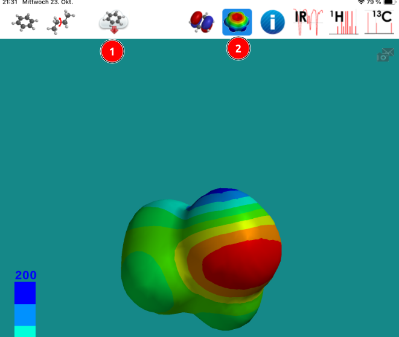  
3. Durch langes Drücken auf die Schaltfläche (2) kannst du den Drahtgitter-Modus auswählen:  
 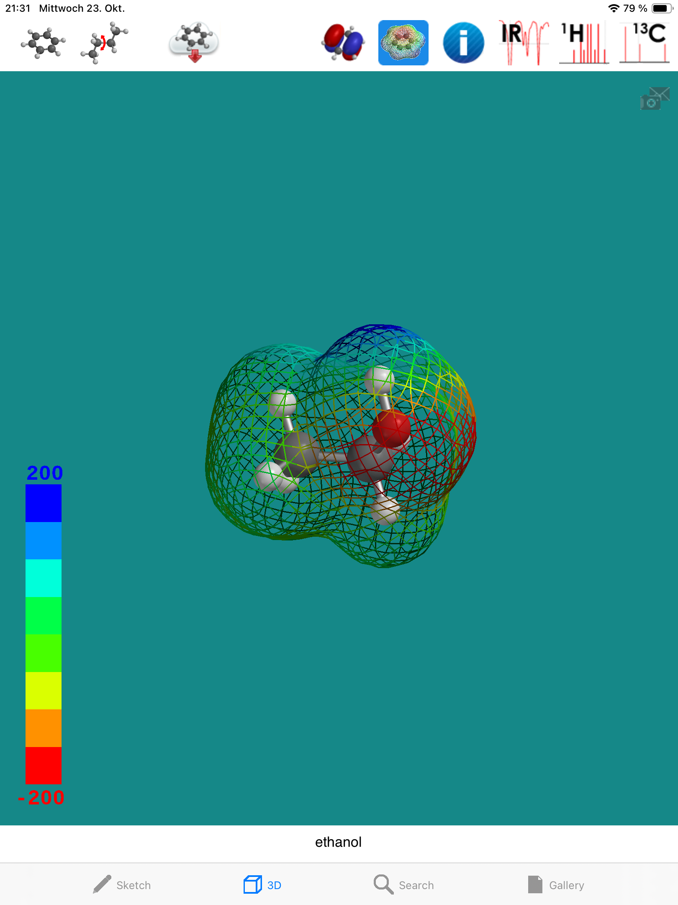  

   
[zurück](../index.html)