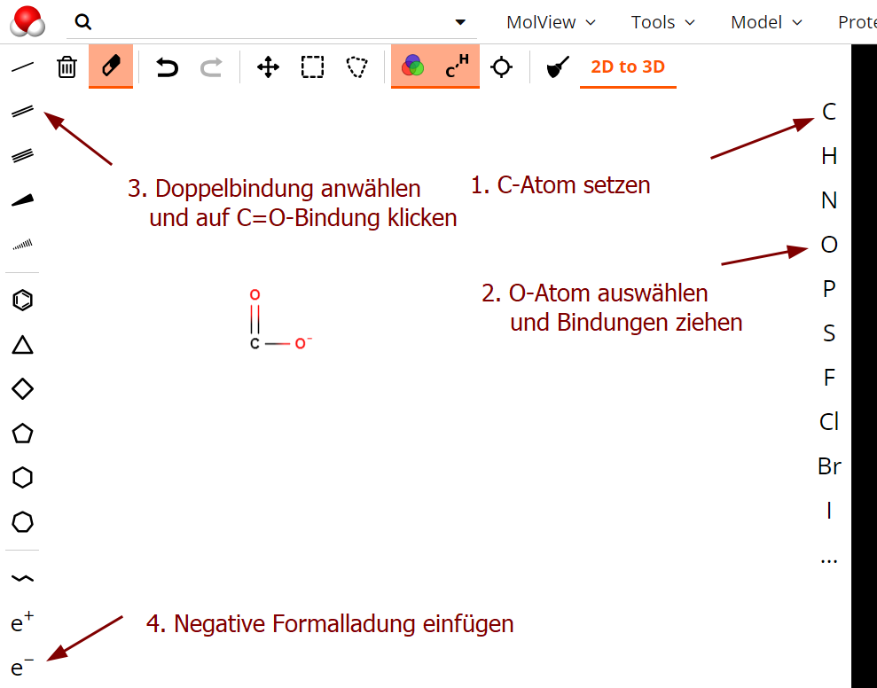

 <link rel="stylesheet" href="https://hi2272.github.io/StyleMD.css">
 
# Die Carboxylat-Gruppe
## Ladungsverteilung
1. Zeichne ein Methanoat-Ion:  
     
2. Lasse dieses in 3D darstellen.
3. Bestimme alle Teilladungen der Atome im Molekül.  
(Menü *Jmol.Charge*)  
4. Vergleiche die angegebenen Werte mit der Valenzstrichformel und begründe die Unterschiede.

# Bindungslänge
1. Bestimme die Bindungslängen der beiden C-O-Bindungen in der Carboxylat-Gruppe.  
(Menü *Jmol.Measurement Distance*)  
2. Vergleiche die angegebenen Werte mit der Valenzstrichformel und begründe die Unterschiede.  
 
[zurück](../index.html)