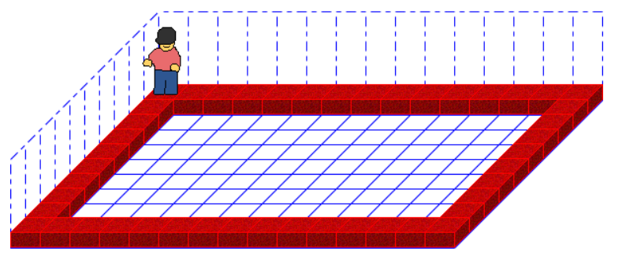

<link rel="stylesheet" href="https://hi2272.github.io/StyleMD.css">

# Wiederholung Grundstrukturen Java


```C++
class Programm {
  Robot karol = new Robot();

  void main() {
    for (int i = 0; i < 4; i++) {
      while (karol.nichtIstWand()) {
        karol.hinlegen();
        karol.schritt();
      }
      karol.linksDrehen();
    }
  }
}
```

[Methoden](02Methoden.html)  

[zurück](../../index.html)  


