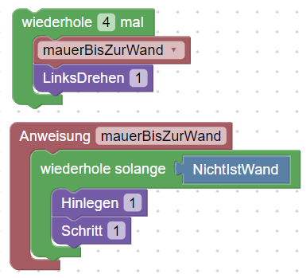

<link rel="stylesheet" href="https://hi2272.github.io/StyleMD.css">

# Wiederholung Grundstrukturen Java

## Die Definition von Methoden

Wandele das Programm unter Verwendung eines selbstdefinierten Methode um:  

## Aufgabenstellung  
1. Schalte in den **Code**-Modus und analysiere die Grundstruktur einer **Methoden**-Deklaration.  
2. Ergänze dein Programm um eine Erstelle eine weitere Methode **steinSchritt**, die einen Stein legt und einen Schritt geht.   

[Lösung](02Loesung.html)  

[zurück](../../index.html)  

