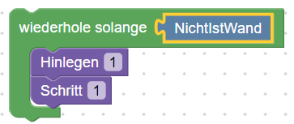
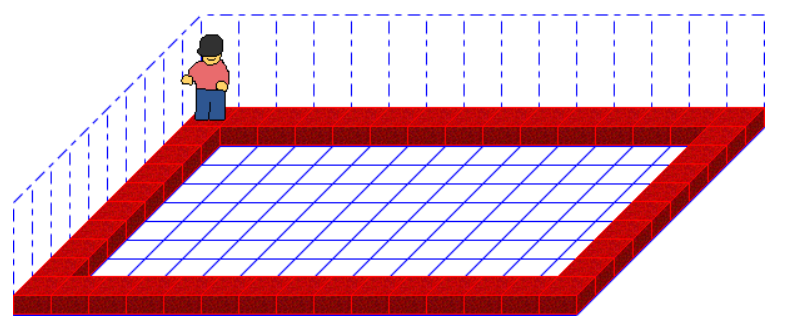

<link rel="stylesheet" href="https://hi2272.github.io/StyleMD.css">

# Wiederholung Grundstrukturen Java

## Die While-Schleife

Erstelle im **Blöcke**-Modus dieses Programm:  

  

1. Schalte in den **Code**-Modus und analysiere die Grundstruktur der **While**-Schleife.  
2. Ergänze dein Programm um eine Zählschleife, um eine Mauer rund um die Welt bauen zu lassen, die genau einen Stein hoch ist:  
   

[Lösung](01Loesung.html)  

[zurück](../../index.html)  

