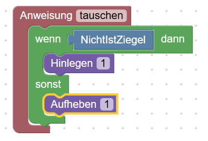

<link rel="stylesheet" href="https://hi2272.github.io/StyleMD.css">

# Wiederholung Grundstrukturen Java

## 4. Bedingte Anweisungen

Erstelle diese Methode im Block-Modus:  
  

## Aufgabenstellung  
1. Beschreibe das Verhalten dieser Methode.
2. Schalte in den **Code**-Modus und analysiere die Grundstruktur einer **bedingten Anweisung** in Java.  
3. Notiere dir den Aufbau einer **bedingten Anweisung**.
4. Ändere dein Programm so ab, dass Karol seine Mauer fünf mal auf- und wieder abbaut.  
   

[Lösung](03Loesung.html)  

[zurück](../../index.html)  

