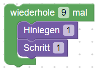
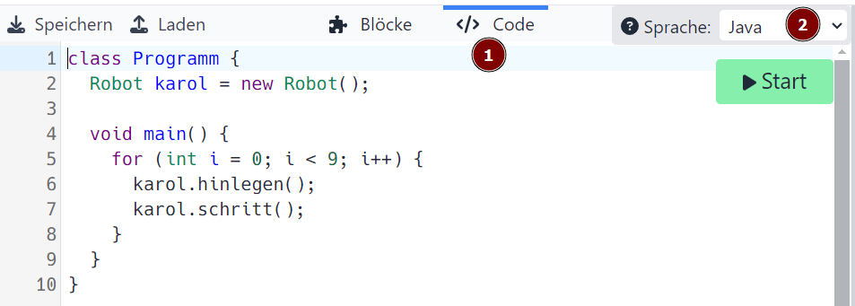

<link rel="stylesheet" href="https://hi2272.github.io/StyleMD.css">

# Wiederholung Grundstrukturen Java

Öffne diese Internetseite:
<a href="https://karol.arrrg.de/#SPIELWIESE" target="_blank">Online-Version von Robot Karol</a>

## 1. Die Zählschleife
Erstelle im **Blöcke**-Modus dieses Programmm:  
  
Schalte in den **Code**-Modus um und stelle als Programmiersprache **Java** ein:  

Beantworte folgende Fragen:
1. Erläutere den Code in Zeile 2.
2. Beschreibe die Struktur einer Zählschleife.
   
[Lösung](00Loesung.html)  

[zurück](../../index.html)  

