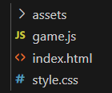

  <meta charset="utf-8" />
  <title>Projekt</title>
  <link rel="stylesheet" href="https://Hi2272.github.io/StyleMD.css">

# Grundstruktur des Breakout-Spiels


<iframe 
  src="10Background/index.html" 
  width="820" 
  height="700" 
  frameborder="0" 
  sandbox="allow-scripts allow-same-origin">
</iframe>

## 1. Wurzelverzeichnis:
  

### 1.1 CSS-Datei: `style.css`

Wir geben dem Body eine dunkelgraue Hintergrundfarbe und stellen die Größe des Spielbereichs ein. 

```css
body {
    margin: 0;
    padding: 0;
    background-color: #222;
    color: #fff;
    font-family: Arial, sans-serif;
    text-align: center;
}

#game-container {
    margin: 20px auto;
    width: 800px;
    height: 600px;
    border: 2px solid white;
}
```
### 1.2 HTML-Datei: `index.html`

(https://cdn.jsdelivr.net/npm/phaser@3/dist/phaser.min.js)

Unsere HTML-Datei bindet Phaser.io ein, lädt die CSS-Datei und unser JavaScript-Game-Script.

```html
<!DOCTYPE html>
<html lang="de">
<head>
    <meta charset="UTF-8" />
    <meta name="viewport" content="width=device-width, initial-scale=1" />
    <title>Breakout mit Phaser.io</title>
    <link rel="stylesheet" href="style.css" />
    <!-- Phaser 3 CDN -->
    <script src="https://cdn.jsdelivr.net/npm/phaser@3/dist/phaser.min.js"></script>
</head>
<body>
    <h1>Breakout-Game mit Phaser.io</h1>
    <div id="game-container"></div>

    <script src="game.js"></script>
</body>
</html>
```


---

---

### 1.3 JavaScript-Datei: `game.js`

In dieser Datei programmieren wir den gesamten Code des Spieles. Derzeit stellt es nur ein leeres Spiel-Fenster mit einer Breite von 800, einer Höhe von 600 Pixel und einem schwarzen Hintergrund dar.

```js
window.onload = function() {
  const config = {
    type: Phaser.AUTO,
    width: 800,
    height: 600,
    backgroundColor: '#000',
    parent: 'game-container',
    scene: {
      preload: preload,
      create: create,
      update: update
    },
  };

  const game = new Phaser.Game(config);

  function preload() {
    // Hier werden Bilder oder Sound-Dateien vor dem Spielstart in den Speicher geladen
  }

  function create() {
    // Wird einmalig beim Start des Spiels aufgerufen und baut das Spielfeld auf
  }

  function update() {
    // Wird als Game-Loop 60x pro Sekunde (60fps) aufgerufen und steuert das eigentliche Spiel
  }
};
```


### 2. Der assets-Ordner


#### 2.1 Bild-Dateien

In der game.js-Datei werden die Maße des Spielfeldes festgelegt:  
````JS
 const config = {
    type: Phaser.AUTO,
    width: 800,
    height: 600,
 ...
 ````
Die Bilder sollten sich an diesen Maßen orientieren:  
- Hintergründe: 800 x 600
- Bricks: 50 x 20
- Paddle: 120 x 20
- Ball: 20 x 20

**Wichtig:**   
Um die Ladezeit möglichst niedrig zu halten, müssen die Bilder **stark komprimiert** werden.   
Hierzu kann die Internetseite (https://squoosh.app/) verwendet werden.

#### Zeichenprogramme
png-Dateien sind pixelorientiert - sie können daher mit jedem einfachen Zeichenprogramm erstellt werden.   
Online-Werkzeuge sind:  
- Piksel: https://www.piskelapp.com/p/create/sprite/
- Draw.io: https://app.diagrams.net  
Draw.io ist eigentlich ein Vektororientiertes Programm. Die Bilder können aber als png-Dateien exportiert werden.


#### 2.2 JSON-Dateien
```json
{
    "layout": [
      [0,0,1,1,1,1,1,0,0],
      [0,2,2,2,2,2,2,2,0],
      [0,3,3,3,3,3,3,3,0],
      [4,5,5,5,5,5,5,5,4]
    ]
}
  ```  
