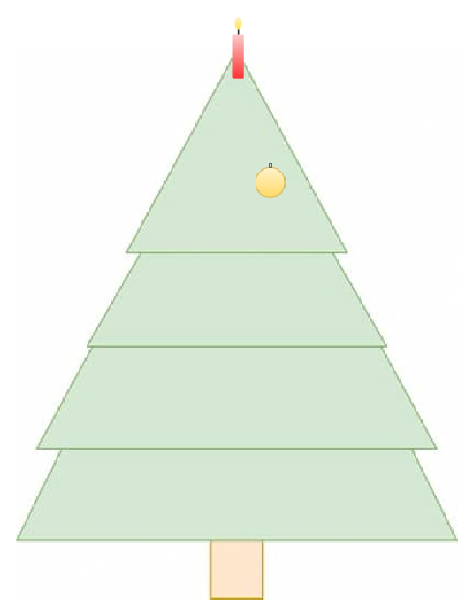
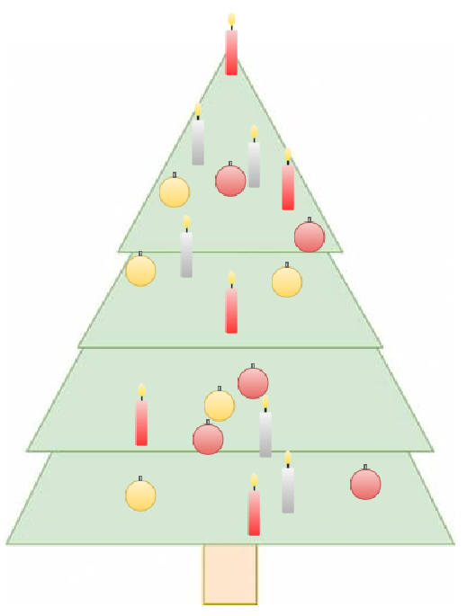

  <meta charset="utf-8" />
  <title>Informatik</title>
  <link rel="stylesheet" href="https://Hi2272.github.io/StyleMD.css">

# Wir schmücken einen Weihnachtsbaum
[BlueJ-Datei](WeihnachtsbaumStart.jar)
1. Öffne das Projekt **WeihnachtsbaumStart**
2. Erzeuge ein neues Welt-Objekt:  

3. Untersuche den Code, mit dem die Kerze und die Kugel erzeugt und in die Welt eingefügt werden.
4. Wandele den Code wie folgt um:
   1. Wandele das Attribut xKerzeRot in ein Feld um, das 5 Werte enthält.
   2. Wandele das Attirbut yKerzeRot genauso um.
   3. Verwende eine Zählschleife um 5 Kerzen an verschiedenen Positionen auf dem Baum einzufügen.
   4. Erzeuge 5 goldene Kugeln nach dem gleichen Muster.
5. Erzeuge eine neue Klasse KugelRot und füge fünf rote Kugeln in das Bild ein.
6. Erzeuge eine neue Klasse KerzeSilber und füge fünf silberne Kerzen in das Bild ein.

Das Ergebnis könnte so aussehen:  
  
[zurück](../../index.html)  
****

Unter Verwendung von:
 <a href='https://www.bluej.org'>BlueJ</a> und 
 <a href='http://www.java-online.ch/gamegrid/gamegridEnglish/index.php?inhalt_links=navigation.inc.php&inhalt_mitte=grundelemente/grid.inc.php'> JGameGrid</a>