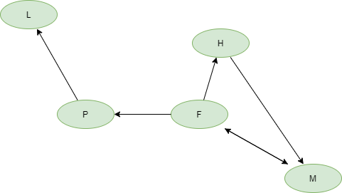

  <meta charset="utf-8" />
  <title>Informatik</title>
  <link rel="stylesheet" href="https://Hi2272.github.io/StyleMD.css">
 
# Flugverbindungen als Graphen
## Lösungen zu den Aufgaben
### 1. Graph  


## 2. Typ des Graphen
Es handelt sich um einen gerichteten, ungewichteten Graphen.

### 3. Adjezenzmatrix
   
||M|F|H|P|L|
|---|---|---|---|---|---|
|**M**|0|1|0|0|0|
|**F**|1|0|1|1|0|
|**H**|1|0|0|0|0|
|**P**|0|0|0|0|1|
|**L**|0|0|0|0|0|

### 4. Zusammenhängender Graph?
Der Graph ist nicht stark zusammenhängend, da von London aus keine Kanten ausgehen - die Zeile in der Matrix enthält nur 0 als Eintragungen. Von London aus ist damit kein anderer Knoten erreichbar.
Er ist schwach zusammenhängend, da in einem ungerichteten Graphen jeder Knoten von jedem anderen Knoten erreicht werden kann. In der Matrix gibt es in jeder Spalte mindestens eine 1, d.h. jeder Knoten kann von einem anderen erreicht werden.
### 5. Kanten, die von M ausgehen 
||M|F|H|P|L|
|---|---|---|---|---|---|
|**M**|**0**|**1**|**0**|**0**|**0**|
|**F**|1|0|1|1|0|
|**H**|1|0|0|0|0|
|**P**|0|0|0|0|1|
|**L**|0|0|0|0|0|

Die Kanten zu den Zielen stehen in der Matrix in einer Zeile.

### 6. Kanten, die in M enden
||M|F|H|P|L|
|---|---|---|---|---|---|
|**M**|**0**|1|0|0|0|
|**F**|**1**|0|1|1|0|
|**H**|**1**|0|0|0|0|
|**P**|**0**|0|0|0|1|
|**L**|**0**|0|0|0|0|

Die Kanten von den Startorten stehen in der Matrix in einer Spalte.

### 7. Das Feld knoten
```Java
private String[] knoten = {"M","F","H","P","L"};
```
### 8. Das Feld kanten
```Java
private int[][] kanten = {
  {0,1,0,0,0},
  {1,0,1,1,0},
  {1,0,0,0,0},
  {0,0,0,0,1},
  {0,0,0,0,0}
};
```
### 9. Alle kanten, die von start ausgehen
kanten[start][0]  
kanten[start][1]  
kanten[start][2]  
kanten[start][3]  
kanten[start][4]

### 10. Alle Kanten, die in ziel enden

kanten[0][ziel]
kanten[1][ziel]
kanten[2][ziel]
kanten[3][ziel]
kanten[4][ziel]

### 11. Methode printKantenZiel
```Java
public void printKantenZiel(int start){
  for (int ziel=0;ziel<knoten.length;ziel++){
    print(kanten[start][ziel]);
  }
  println();
}
```

### 12. Methode printKantenStart
```Java
public void printKantenStart(int ziel){
  for (int start=0;start<knoten.length;start++){
    print(kanten[start][ziel]);
  }
  println();
}
```
<div id="quelle" style="font-size: x-small; text-align: right;">
    2025 Rainer Hille  Unter Verwendung der  <a href='https://www.online-ide.de/'>Online-IDE von Martin Pabst</a><br>Hinweis: Der Code-Editor muss erst geladen werden. Klicke ggf. auf <b>Code Reset</b> um den Programmcode neu zu laden.

  </div>
  
  <section>
    <iframe
    srcdoc="<script>window.jo_doc = window.frameElement.textContent;</script><script src='https://Hi2272.github.io/include/js/includeide/includeIDE.js'></script>"
    width="100%" height="600" frameborder="0">
    {'id': 'Java', 'speed': 2000, 
    'withBottomPanel': true ,'withPCode': false ,'withConsole': true ,
    'withFileList': true ,'withErrorList': true}
    <script id="javaCode" type="plain/text" title="Graph.java" src="Graph.java"></script>
    <script id="javaCode" type="plain/text" title="Main.java" src="Main.java"></script>
  </script>
   </iframe>
</section>

## [weiter](../03Kanten2/index.html)    
## [Index](../../../index.html)

