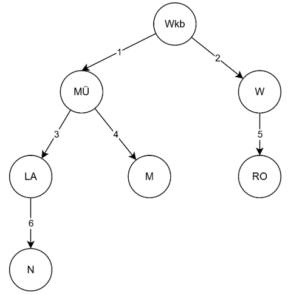
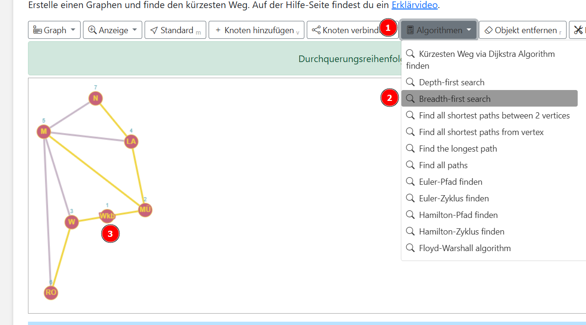

  <meta charset="utf-8" />
  <title>Informatik</title>
  <link rel="stylesheet" href="https://Hi2272.github.io/StyleMD.css">
 

# Breitensuche
## Problemstellung
Du hast an einem Bahnhof dein Handy verloren. Um es wiederzufinden, schickst du mehrere Freunde los, die ausgehend von deinem Startbahnhof in Waldkraiburg (Wkb) an allen Bahnhöfen suchen sollen. Jeder Bahnhof muss einmal, aber kein Bahnhof darf mehrfach besucht werden. 

## Besuchsreihenfolge

## Animation des Algorithmus

Wähle im Menü (1) Algorithmen (2) **Breadth-first search** und klicke dann auf den Knoten Wkb (3) um den Algorithmus von diesem Knoten aus zu starten.  

  

## <a href="http://graphonline.top/de/?graph=SfFgJEbYivkqVUxM" target=_blank>Link zur Animation</a>  

## Algorithmus mit Stift und Papier
Zeichne den Graphen ab und erstelle rechts daneben eine Tabelle nach folgendem Muster:
| Schritt | aktueller Knoten | Warteschlange | besucht |
|---------|------------------|---------------|---------|
| 0       |                  | Wkb           |         |
| 1       | Wkb              | ...        |         |
| ...       |               |         |         |

## [weiter](../03Tabelle/index.html)  
## [Index](../../../index.html)

