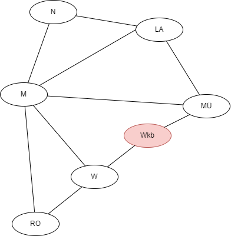

  <meta charset="utf-8" />
  <title>Informatik</title>
  <link rel="stylesheet" href="https://Hi2272.github.io/StyleMD.css">
 

# Breitensuche

## Algorithmus mit Stift und Papier

  
| Schritt | aktueller Knoten | Warteschlange (Queue)| besucht |
|---------|------------------|---------------|---------|
| 0       |                  | Wkb           |         |
| 1       | Wkb              | MÜ,W       |  Wkb      |
| 2       | MÜ              | W,M,LA       |  MÜ      |
| 3       | W              | M,LA,RO       |  W      |
| 4       | M              | LA,RO,N       |  M      |
| 5       | LA              | RO,N       |  LA      |
| 6       | RO              | N       |  RO      |
| 7       | N              |        |  N      |

## Fragestellungen zum Algorithmus
1. Welcher Knoten wird im Schritt 0 in die Warteschlange  eingefügt.
2. Welcher Knoten wird jeweils aus der Warteschlange entfernt.
3. An welcher Position werden neue Knoten in die Warteschlange eingefügt?
4. Welche Knoten werden jeweils in die Warteschlange eingefügt?
5. Warum endet die Breitensuche nach Schritt 7?  
6. Wann würde die Breitensuche früher enden?  

## [weiter](../04LoesungTabelle/index.html)  
## [Index](../../../index.html)
