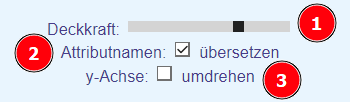
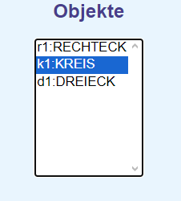
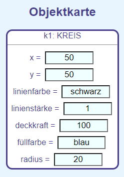

  <meta charset="utf-8" />
  <title>Informatik</title>
  <link rel="stylesheet" href="https://Hi2272.github.io/StyleMD.css">

# Attribut-Editor  
## Allgemeine Bedienung
### Grundeinstellungen
  
1. Stellt die Deckkraft des gesamten Bildes ein. Hierdurch kann das Gitternetz auch hinter gefüllten Objekten sichtbar gemacht werden.  
2. Die Attributnamen werden aus dem Englischen ins Deutsche übersetzt.
3. Die y-Achse steigt von unten nach oben oder umgekehrt.
### Die Objektliste
  
In dieser Liste werden alle Objekte angezeigt, aus denen das Bild aufgebaut ist.  
Durch Anklicken eines Objekts wird seine Objektkarte dargestellt.  

## Erzeugen neuer Objekte
Neue Objekte werden durch einen Klick auf die enstprechende Schaltfläche erzeugt.  
Sie erhalten automatisch einen neuen Objektnamen.
## Ändern der Werte der Attribute
In der Objektkarte werden die Attribute und ihre Werte angezeigt:  
  

Diese Werte können geändert werden. Sobald das entsprechende Eingabefeld verlassen wird, wird das Objekt mit den neuen Attributwerten neu gezeichnet.  
Bei Linien und Dreiecken treten zwei besondere Attribute auf:
- Linie:
  - dx: Entfernung des Endpunktes vom Startpunkt in x-Richtung
  - dy: Entfernung des Endpunktes vom Startpunkt in y-Richtung
- Dreieck:
  - dx1,dy1: Entfernung des 2. Eckpunktes vom 1. Eckpunkt in x und y-Richtung
  - dx2,dx2: Entfernung des 3. Eckpunktes vom 1. Eckpunkt in x und y-Richtung

### Farben
Für die Füll- und Linienfarben können deutsche oder englische Bezeichnungen verwendet werden:  
 - blau: blue,  
 - gruen: green,  
 - grün: green,  
 - gelb: yellow,  
 - rot: red,  
 - weiß: white,  
 - weiss: white,  
 - schwarz: black,  
 - hellblau: lightblue,  
 - hellgrün: lightgreen,  
 - violett: violet,  
 - lila: violet,  
 - hellgelb: lightyellow,  
 - hellrot: pink,  
 - rosa: pink, 
 - braun: brown,  
 - silber: silver,  
 - dunkelblau: darkblue,  
 - olivgrün: olive,  
 - grau: grey,  
 - hellgrau: lightgrey  
  
  
**Die Farben können auch aus den Grundfarben definiert werden:**  
- ##RotGrünBlau  
- #000000: Schwarz
- #FFFFFF: Weiß
- #AAAAAA: Grau  
- #FF0000 : Rot
- #00FF00: Grün
- #0000FF: Blau
- #0000AA: dunkleres Blau
- #000066: noch dunkleres Blau

  
Mit dem Parameter-Wert **keine** oder **none** kann eine Figur ohne Füllung gezeichnet werden.  
## Löschen von Objekten
Objekte können nicht einzeln gelöscht werden. Sie können aber unsichtbar gemacht werden, wenn der Wert des Attribut **Deckkraft** auf **0** gesetzt wird.  
Um die gesamte Zeichnung zu löschen, muss die Internetseite aktualisiert werden (Taste F5).  
  
  
[zurück](index.html)  
