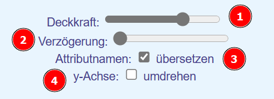

  <meta charset="utf-8" />
  <title>Informatik</title>
  <link rel="stylesheet" href="https://Hi2272.github.io/StyleMD.css">

# Graphix-Editor  
[Erzeugen neuer Objekte](#1-erzeugen-neuer-objekte)|
[Aufruf von Methoden](#2-aufruf-von-methoden)|
[Alle Klassen](#alle-klassen)|
[Linie](#linie-line)|
[Rechteck](#rechteck-rect-rectangle)|
[Dreieck](#dreieck-triangle)|
[Kreis](#kreis-circle)| 
[Gruppe](#gruppe-group)| 
[Farben](#farben)| 
[Deckkraft](#deckkraft)| 
[Wiederholungen](#wiederholungen)| 
[Skalieren](#skalieren-vergrößern-und-verkleinern-von-objekten)| 
[Kopieren](#kopieren-von-objekten-oder-gruppen)
## Voreinstellungen
Im Editorfenster können folgende Einstellungen vorgenommen werden:  
  
1. Stellt die Deckkraft des gesamten Bildes ein. Hierdurch kann das Gitternetz auch hinter gefüllten Objekten sichtbar gemacht werden.  
2. Stellt die Verzögerung zwischen den einzelnen Programmschritten ein. Damit kann das schrittweise Abarbeiten des Programm beobachtet werden.  
3. Die Attributnamen werden aus dem Englischen ins Deutsche übersetzt.
4. Die y-Achse steigt von unten nach oben oder umgekehrt.
## 1. Erzeugen neuer Objekte
Vor der Verwendung müssen Objekte erzeugt werden. Dies geschieht nach folgendem Muster:  
  
  **Objektname:Klassenname**  
  
Graphix kennt folgende Klassen:
- Rechteck (Rect, Rectangle)
- Kreis (Circle)
- Linie (Line)
- Dreieck (Triangle) 
   
Es können sowohl die deutschen, als auch die englischen Klassenbezeichner verwendet werden.  
Groß- und Kleinschreibung wird allgemein nicht beachtet.  
**re:rect, Re:Rect, re:Rectangle** oder **re:Rechteck** erzeugen alle ein Objekt mit dem Namen **re** aus der Klasse **Rechteck**.
## 2. Aufruf von Methoden
Methoden werden nach folgendem Muster aufgerufen:  
  
  **Objektname.Methodenname(Parameter)**  
    
Auch bei den Methodennamen können deutsche oder englische Bezeichnungen verwendet werden.  
## 3. Klassen und Methoden
### Alle Klassen
#### Attribute
- x,y: Koordinaten des Objekts
- stroke: Linienfarbe 
- strokeWidth: Linienbreite
- fill: Füllfarbe (außer bei der Klasse Linie)
#### Methoden
- **setFill(color), setColor(farbe), füllfarbeSetzen(farbe), setzeFüllfarbe(farbe), setFüllfarbe(farbe)**  
  Setzt die Füllfarbe eines geschlossenen Objekts.   
- **setStroke(color),  linienfarbeSetzen(farbe), setzeLinienfarbe(farbe), setLinienfarbe(farbe)**  
  Setzt die Linienfarbe des Objekts.
- **setStrokeWidth(width), linienbreiteSetzen(breite), setzeLinienbreite(breite), setLinienbreite(breite)**  
  Setzt die Breite der Linie des Objekts.
- **moveX(dx), verschiebeX(dx)**  
  Verschiebt das Objekt um dx Einheiten nach rechts (postives dx) oder links (negatives dx)
- **moveY(dy), verschiebeY(dy)**  
   Verschiebt das Objekt um dy Einheiten nach unten (positives dy) oder oben (negatives dy)
- **moveTo(x,y), verschiebeZu(x,y), verschiebeNach(x,y)**  
  Verschiebt das Objekt auf die Position mit den Koordinaten (x,y)  
#### Parameter
Farben werden als englische Wörter ohne Anführungszeichen eingetragen: 
### Linie (Line)
#### Attribute
- x,y,x1,y1 : Koordinaten der beiden Endpunkte der Linie
- stroke: Linienfarbe
- strokeWidth: Linienbreite  
  
*Achtung:  
 Eine Linie ist keine geschlossene Figur. Sie hat daher auch kein Attribut Füllfarbe.*

#### Zusätzliche Methoden
- **setPoints(x1,y1,x2,y2), punkteSetzen(x1,y1,x2,y2), setzePunkte(x1,y1,x2,y2), setPunkte(x1,y1,x2,y2)**  
  Setzt die Koordinaten der beiden Endpunkte der Linie.  
  
### Rechteck (Rect, Rectangle)
#### Attribute
- x,y : Koordinaten der linken oberen Ecke
- width : Breite
- height: Höhe
- fill: Füllfarbe
- stroke: Linienfarbe
- strokeWidth: Linienbreite
#### Zusätzliche Methoden
- **setWidth(width), breiteSetzen(breite), setzeBreite(breite), setBreite(breite)**    
  Setzt den Wert des Attributs Breite.
- **setHeight(height), höheSetzen(höhe), setzeHöhe(höhe), setHöhe(höhe)**  
  Setzt den Wert des Attributs Höhe.
- **setPoints(x1,y1,x2,y2), punkteSetzen(x1,y1,x2,y2), setzePunkte(x1,y1,x2,y2), setPunkte(x1,y1,x2,y2),eckenSetzen(x1,y1,x2,y2)**  
  Setzt die Koordinaten der linken unteren und der rechten oberen Ecke des Rechtecks.

### Dreieck (Triangle)
#### Attribute
- x,y,x1,y1,x2,y2 : Koordinaten der drei Ecken
- fill: Füllfarbe
- stroke: Linienfarbe
- strokeWidth: Linienbreite
#### Zusätzliche Methoden
- **setPoints(x1,y1,x2,y2,x3,y3), punkteSetzen(x1,y1,x2,y2,x3,y3), setzePunkte(x1,y1,x2,y2,x3,y3), setPunkte(x1,y1,x2,y2,x3,y3), eckensetzen(x1,y1,x2,y2,x3,y3)**  
  Setzt die Koordinaten der drei Ecken.

### Kreis (Circle)
#### Attribute
- x,y : Koordinaten des Mittelpunkts
- radius : Radius
- fill: Füllfarbe
- stroke: Linienfarbe
- strokeWidth: Linienbreite
#### Zusätzliche Methoden
- **setRadius(radius), setzeRadius(radius), radiusSetzen(radius)**    
  Setzt den Wert des Attributs Radius.
- **setPoints(x,y), mittelpunktSetzen(x,y), setzeMittelpunkt(x,y), setMittelpunkt(x,y)**  
  Setzt die Koordinaten des Mittelpunkts.  

### Gruppe (Group)
In eine Gruppe können zuvor gebildete Objekte aufgenommen worden.  
Für alle Objekte der Gruppe können anschließend gemeinsame Methoden aufgerufen werden.
#### Attribute
Die Attribute sind die Objekte, die in die Gruppe aufgenommen wurden.
#### Methoden
- **add(Objektname), schlucke(Objektname), fügezu(Objektname), hinzufügen(Objektname)**  
  Fügt das entsprechende Objekt der Gruppe hinzu.  
  Es können auch mehere Objekte gleichzeitig hinzugefügt werden. Die Objektnamen müssen dann als Parameterliste durch Kommas getrennt werden:  
  ``` Javascript
  g.add(re,c,d)
  ```
  Fügt die Objekte **re, c** und **d** zur Gruppe **g** hinzu.  
- **beliebige Methode**  
  Führt diese Methode für alle Objekte der Gruppe aus.
                    
### Farben
Für die Füll- und Linienfarben können deutsche oder englische Bezeichnungen verwendet werden:  
 - blau: blue,  
 - gruen: green,  
 - grün: green,  
 - gelb: yellow,  
 - rot: red,  
 - weiß: white,  
 - weiss: white,  
 - schwarz: black,  
 - hellblau: lightblue,  
 - hellgrün: lightgreen,  
 - violett: violet,  
 - lila: violet,  
 - hellgelb: lightyellow,  
 - hellrot: pink,  
 - rosa: pink, 
 - braun: brown,  
 - silber: silver,  
 - dunkelblau: darkblue,  
 - olivgrün: olive,  
 - grau: grey,  
 - hellgrau: lightgrey  
 
  
**Die Farben können auch aus den Grundfarben definiert werden:**  
- ##RotGrünBlau  
- #000000: Schwarz
- #FFFFFF: Weiß
- #AAAAAA: Grau  
- #FF0000 : Rot
- #00FF00: Grün
- #0000FF: Blau
- #0000AA: dunkleres Blau
- #000066: noch dunkleres Blau
  
Mit dem Parameter-Wert **keine** oder **none** kann eine Figur ohne Füllung gezeichnet werden.  

### Deckkraft
Die Deckkraft (engl. opacity) der Objekte kann zum einen über einen Schieberegler eingestellt werden. Durch eine niedrigere Deckkraft kann das Koordinatensystem auch hinter gefüllten Objekten sichtbar gemacht werden.  
Mit der Methode **deckkraftSetzen(), setDeckkraft(), setOpac(), setOpacity()** kann die individuelle Deckkraft eines Objektes angepasst werden. Hierdurch sind interessante Farbmischungen möglich.  

### Wiederholungen
Graphix kann einfache Wiederholschleifen umsetzen.  
Eine Schleife beginnt mit dem Schlüsselwort **wdh** und der Zahl der gewünschten Wiederholungen. Alternativ kann auch **wiederhole** oder **repeat** verwendet werden.  
Die Schleife endet mit einem *  .  
**Beispiel:**  
``` Javascript
wdh 50 
  g.moveX(1)
*
```
Lässt das Objekt g 50 einzelne Schritte nach rechts machen.

### Kopieren von Objekten oder Gruppen
Mit der Methode **copyPaste(nam,dx,dy)** können bestehende Objekte verdoppelt werden. Alternativ können auch die Methodennamen **dupliziere, duplicate** oder **verdoppele** verwendet werden.  
Die Methode benötigt drei Parameter:  
- nam: Name des neuen Objekts
- dx: Verschiebung in x-Richtung
- dy: Verschiebung in y-Richtung  
**Beispiel:**  
``` Javascript
wdh 50 
  g.copyPaste(g1,100,0)
*
```
Erzeugt ein Objekt g1 als Kopie von g - g1 ist um 100 Punkte nach rechts verschoben.
  
### Skalieren: Vergrößern und Verkleinern von Objekten
Mit der Methode **skaliere, scale, strecke, vergrößere** kann ein Objekt vergrößert oder verkleinert werden.  
Der Parameter gibt den Vergrößerungsfaktor in Prozent an:  
- o.skaliere(110) vergrößert das Objekt o auf 110% seiner Originalgröße
- o.skaliere(90) verkleinert das Objekt o auf 90% seiner Orginalgröße  
  
                                         
[zurück](index.html)  
