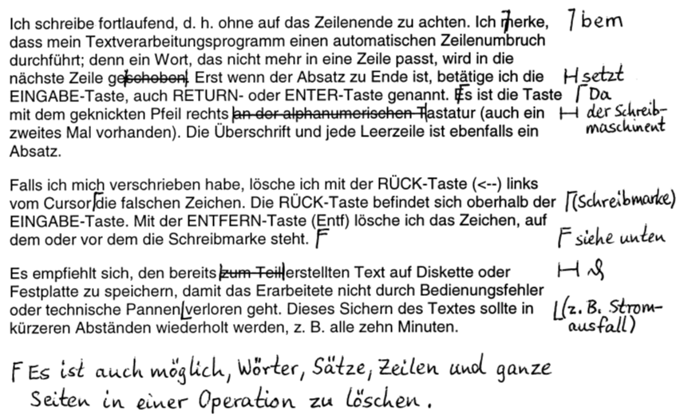

<link rel="stylesheet" href="https://hi2272.github.io/StyleMD.css">

## Markieren und Kopieren von Text

1. Markiere den folgenden Text, indem du mit **gedrückter linker Maustaste** über ihn fährst.
2. Kopiere ihn in die Zwischenablage, indem du mit der **rechten Maustaste** auf den markierten Text klickst und **Kopieren** auswählst.
3. Starte das Textverarbeitungsprogramm.
4. Füge den kopierten Text ein, indem du mit der **rechten Maustaste** auf die weiße Seite klickst und **Einfügen** wählst.  

Ich schreibe fortlaufend, d. h. ohne auf das Zeilenende zu achten. Ich merke, dass mein Textverarbeitungsprogramm einen automatischen Zeilenumbruch durchführt; denn ein Wort, das nicht mehr in eine Zeile passt, wird in die nächste Zeile geschoben. Erst wenn der Absatz zu Ende ist, betätige ich die EINGABE-Taste, auch RETURN- oder ENTER-Taste genannt. Es ist die Taste mit dem geknickten Pfeil rechts an der alphanumerischen Tastatur (auch ein zweites Mal vorhanden). Die Überschrift und jede Leerzeile ist ebenfalls ein Absatz.
Falls ich mich verschrieben habe, lösche ich mit der RÜCK-Taste  (<--) links vom Cursor die falschen Zeichen. Die RÜCK-Taste befindet sich oberhalb der EINGABE-Taste. Mit der ENTFERN-Taste (Entf) lösche ich das Zeichen, auf dem oder vor dem die Schreibmarke steht.
Es empfiehlt sich, den bereits zum Teil erstellten Text im Schülerordner (bzw. auf Diskette oder Festplatte) zu speichern, damit das Erarbeitete nicht durch Bedienungsfehler oder technische Pannen verloren geht. Dieses Sichern des Textes sollte in kürzeren Abständen wiederholt werden, z. B. alle zehn Minuten.

## Korrigieren von Text

Korrigiere den Text in der Textverarbeitung nach diesen Korrekturhinweisen:  

  
