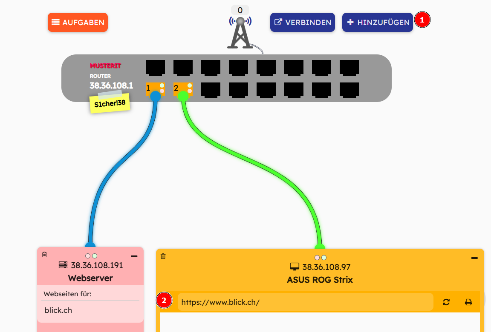
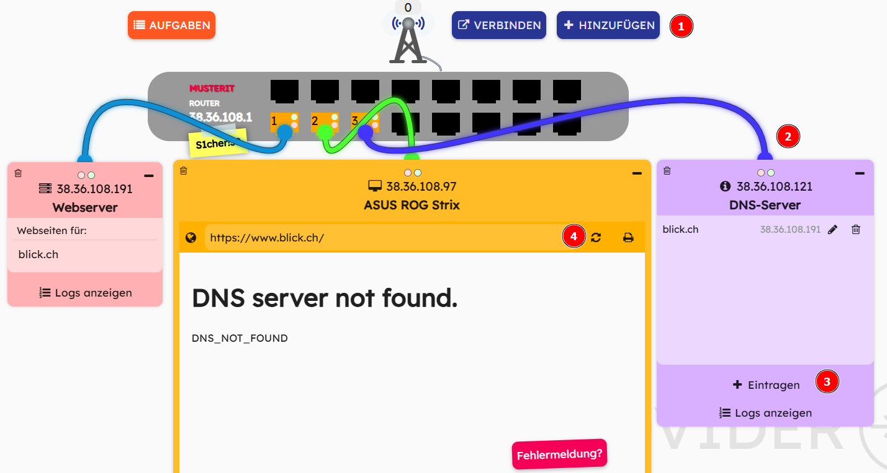

  <meta charset="utf-8" />
  <title>Informatik</title>
  <link rel="stylesheet" href="https://Hi2272.github.io/StyleMD.css">
 
 # Webserver, DNS-Server, Provider?

1. Klicke auf diesen Link: <a href="https://webnetsim.de/" target=_blank>https://webnetsim.de/</a>

2. Klicke auf STARTEN:    

   
 
3.  Klicke auf PROVIDER  
  
4. Trage einen beliebigen Namen für deinen Provider ein und klicke auf OK  
  
5. Du siehst die IP-Adresse deines Routers im Spiel. Klicke auf OK.  
  
6. Füge einen Webserver hinzu und trage als Webseite blick.ch ein. Der Server hostet jetzt diese Seite, d.h. er stellt sie anderen Rechnern über das Netzwerk zur Verfügung.  
  
7. Füge einen Computer hinzu und trage als Internetadresse blick.ch ein.  
  
Was geschieht, wenn du die Seite aufrufst?  
Klicke auf **Fehlermeldung?**, im Fenster des Computers.
8. Rufe die Seite durch die Eingabe ihrer IP-Adresse auf.
9. Füge einen DNS-Server hinzu und trage die Seite blick.ch ein.  
    
Versuche jetzt, die Seite am Rechner durch die Eingabe der Adresse **blick.ch** aufzurufen.     
Erläutere, wie ein DNS-Server funktioniert.  
  
10. Baue dein Netzwerk weiter aus, indem du zwei weitere Webserver einbindest und ihre Adressen in die Liste des DNS-Servers einträgst.
11. Binde ein Smartphone über das Mobilfunknetz in dein Netzwerk ein.
12. Binde ein weiteres Smartphone über WLAN in dein Netzwerk ein. Hierzu benötigt dein Router einen Access-Point.  
Erläutere die Funktion eines Access-Points.  
### Zusammenfassung
Beschreibe in deinem Heft die Aufgaben folgender Netzwerk-Bauteile:  
- Webserver
- DNS-Server
- Access-Point

## [Index](../../index.html)  