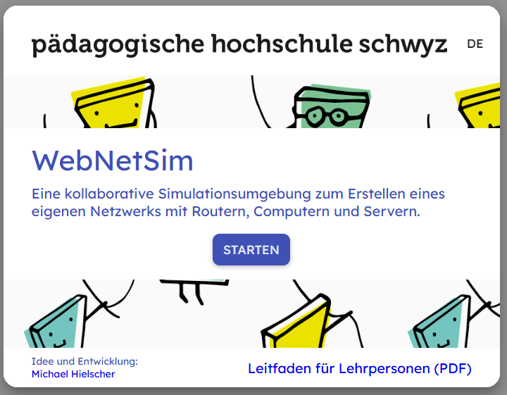
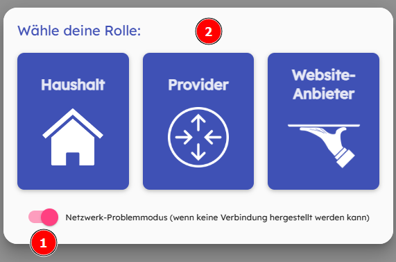

  <meta charset="utf-8" />
  <title>Informatik</title>
  <link rel="stylesheet" href="https://Hi2272.github.io/StyleMD.css">
 
 # Ein eigenes Internet

Mit WebNetSim erzeugen wir im Computerraum mehrere getrennte Netzwerke, die jeweils ein Internet simulieren.

1. Bildet dazu Gruppen von 3-4 Schülern.

2. Klicke auf diesen Link: <a href="https://webnetsim.de/" target=_blank>https://webnetsim.de/</a>

3. Klicke auf STARTEN:    

   
 
1. Aktiviere jetzt den **Netzwerk-Problemmodus**
2. Wähle deine Rolle in deiner Gruppe: 
- 1 x [Provider](Provider.html)
- 1 x [WebSite-Anbieter](Webserver.html)
- 1-2 x [Haushalt](Haushalt.html)  

## [Index](../../index.html)  