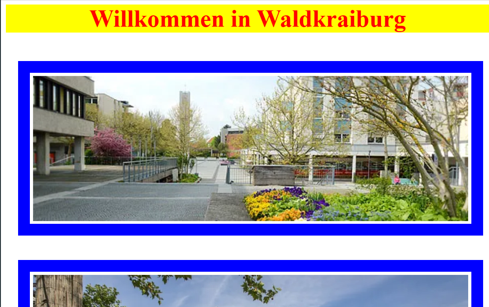
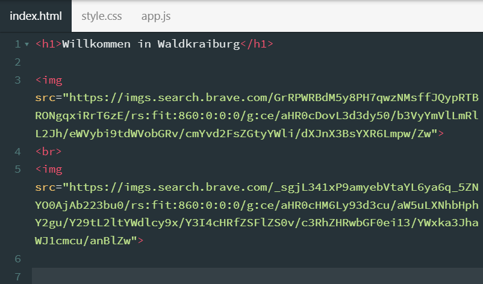
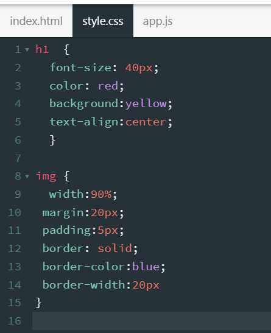

  <meta charset="utf-8" />
  <title>CSS</title>
  <link rel="stylesheet" href="https://Hi2272.github.io/StyleMD.css">

# CSS - ein Stil für alle
Wir erzeugen eine HTML-Datei, bei der
- alle Überschriften h1 rot auf gelbem Grund ist
- alle Bilder einen blauen Rahmen haben und 90% breit sind.

  

In der HTML-Datei siehst du nichts von diesen Formatierungen:

  

Sie werden in einer CSS (Cascading Style Sheet)-Datei eingefügt und gelten für alle Überschriften h1 und alle Bilder img:  

Öffne die Seite <a href="https://ladigitale.dev/digipen/editeur.html" target="_blank">Digipen by LaDigitale</a> und erstelle eine Seite für deine Heimatstadt nach diesem Muster.   

Hinweis: Die **{}**-Zeichen bekommst du mit der Tastenkombination **AltGr 7** und **AltGr 0**.
