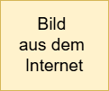

  <meta charset="utf-8" />
  <title>Informatik</title>
  <link rel="stylesheet" href="https://Hi2272.github.io/StyleMD.css">
 
 # Ferienübung

 Erstelle in diesem Editor [https://ladigitale.dev/digipen/editeur.html](https://ladigitale.dev/digipen/editeur.html) eine Internetseite, in der du deine Ferien beschreibst. 

# Meine Ferien
  
In den Ferien möchte ich...
 - lang ausschlafen.
 - viel lesen.
 - ins Schwimmbad gehen:  
 [Link zur Startseite des Schwimmbads]( )

 - ...

## [Index](../../index.html)  