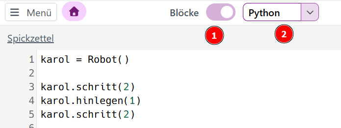

# Robot Karol

## Anweisung und Sequenz

Öffne diese Seite:   
<a href="https://karol.arrrg.de/#QUEST-1" target="_blank">Start</a>  

Trage einen beliebigen Namen ein 
und löse folgende Aufgaben:
1. Start
2. Umweltschutz
3. Um die Ecke
4. Verschieben

### Umschalten auf Python

 
1. Schalte die Blockansicht aus.
2. Wähle Python als Programmiersprache.
3. Untersuche deinen Programmcode in dieser Sprache.
   
### Hefteintrag

## Programmieren mit Robot Karol

Ein Computerprogramm besteht aus einer Sequenz von Anweisungen, die nacheinander ausgeführt werden:

```C++
1 karol = Robot()
2 karol.schritt(2)
3 karol.hinlegen(1)
```
---------

## Zusatzaufgaben
Erweitere das Programm von oben:  

4. Karol soll zwei Schritte weitergehen.  
5. Ein neuer Roboter mit dem Namen **kara** soll erscheinen.  
6. Kara soll den Stein aufheben, den Karol gelegt hat.  
7. Kara soll weitergehen, bis sie rechts neben Karol steht und in die gleiche Richtung schaut wie er.


