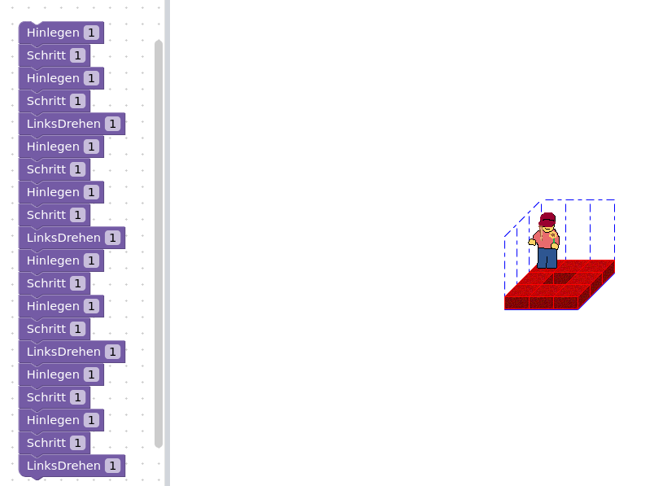
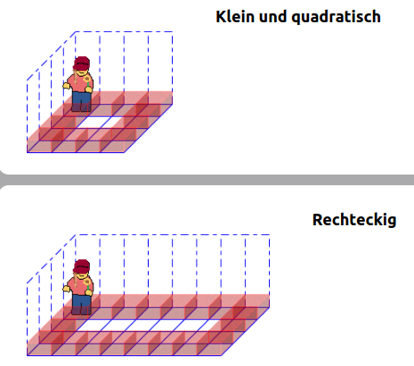

# Kurzer Code durch Schleifen
### Code verkürzen
Mit 20 Codeblöcken baut Karol einen Rahmen um seine Welt.
Das geht aber auch kürzer.
Verwende Schleifen mit fester Wiederholungszahl, so dass 5 Blöcke ausreichen.

<a href="https://karol.arrrg.de/#4X4C" target="_blank">Online Karol Editor</a>

### Mauern um beliebig große Welten
Unser Code funktioniert nur in quadratischen Welten:  

Für allgemeine Rechtecke muss Karol solange eine Mauer bauen, bis er vor der Wand steht:

<a href="https://karol.arrrg.de/#QUEST-24" target="_blank">Online Karol Editor</a>

Löse alle Aufgaben im Bereich **Bedingte Wiederholung**:
<a href="https://karol.arrrg.de/#OVERVIEW" target="_blank">Online Karol Liste der Aufgaben</a>
