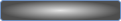

# Breakout-Game Tutorial mit Phaser.io

## Schritt 3: Paddle hinzufügen und mit Cursor/Maus steuern

Jetzt erweitern wir unser Spiel um das Paddle, mit dem du den Ball später kontrollierst. Das Paddle laden wir aus dem Bild-Asset `paddle.png`.

---

### 3.1 Vorbereitung: Asset `paddle.png`

Speichere die Datei `paddle.png` im Ordner `assets` (gleicher Ordner wie `ball.png`).



---

### 3.2 Code-Anpassungen in `game.js`

Wir erweitern den Code um das Paddle, das mit den Pfeiltasten oder mit der Maus entlang der X-Achse bewegt wird. Der Ball prallt noch nicht am Paddle ab und bleibt immer im Spielfeld.

```js
window.onload = function() {
  const config = {
    type: Phaser.AUTO,
    width: 800,
    height: 600,
    backgroundColor: '#000',
    parent: 'game-container',
    physics: {
      default: 'arcade',
      arcade: {
        gravity: { y: 0 },
        debug: false,
      }
    },
    scene: {
      preload: preload,
      create: create,
      update: update,
    },
  };

  let ball;
  let paddle;
  let cursors;

  const game = new Phaser.Game(config);

  function preload() {
    this.load.image('ball', 'assets/ball.png');
    this.load.image('paddle', 'assets/paddle.png');
  }

  function create() {
    const width = this.sys.game.config.width;
    const height = this.sys.game.config.height;

    // Ball in der Mitte erstellen
    ball = this.physics.add.image(width / 2, height / 2, 'ball');
    ball.setVelocity(150, 150);
    ball.setCollideWorldBounds(true);
    ball.setBounce(1);

    // Paddle an unteren Rand setzen, mittig horizontal
    paddle = this.physics.add.image(width / 2, height - 50, 'paddle');
    paddle.setImmovable(true);         // Paddle soll sich nicht durch Kollision bewegen
    paddle.setCollideWorldBounds(true); // Paddle bleibt im Spielfeld

    // Cursor-Tasten einlesen
    cursors = this.input.keyboard.createCursorKeys();

    // Mausbewegung erfassen – X-Position übernimmt Paddle (Y bleibt fix)
    this.input.on('pointermove', pointer => {
      paddle.x = Phaser.Math.Clamp(pointer.x, paddle.width / 2, width - paddle.width / 2);
    });
  }

  function update() {
    // Paddle mit Pfeiltasten bewegen
    if (cursors.left.isDown) {
      paddle.setVelocityX(-300);
    } else if (cursors.right.isDown) {
      paddle.setVelocityX(300);
    } else {
      paddle.setVelocityX(0);
    }

    // Ball prallt noch nicht am Paddle ab
    // Ball kann also weiterhin frei im Spielfeld herumfliegen
  }
};
```

### Erläuterungen zum Code
#### paddle
Das Paddle wird analog zum Ball aus den Assets geladen und ins Spiel eingebunden.
#### `paddle.setCollideWorldBounds(true);`
Das Paddle prallt von den Wänden des Spielfeldes ab. Damit bleibt es immer im sichtbaren Bereich.
#### `cursors = this.input.keyboard.createCursorKeys();` 
Wir erzeugen eine Referenz auf die Pfeiltasten (Cursor links/rechts). 
#### `if (cursors.left.isDown) {...`  
Im `update()`-Loop fragen wir jetzt die Cursor-Tasten regelmäßig ab und bewegen das Paddle entsprechend nach links oder rechts.
#### `this.input.on('pointermove', pointer => {`
An dieser Stelle binden wir die x-Koordinate des Paddles direkt an die x-Koordinate des Mauszeiger (Pointer). Das Paddle kann damit horizontal mit der Maus bewegt werden.

### Live-Test

<iframe 
  src="02Paddle/index.html" 
  width="820" 
  height="700" 
  frameborder="0" 
  sandbox="allow-scripts allow-same-origin">
</iframe>