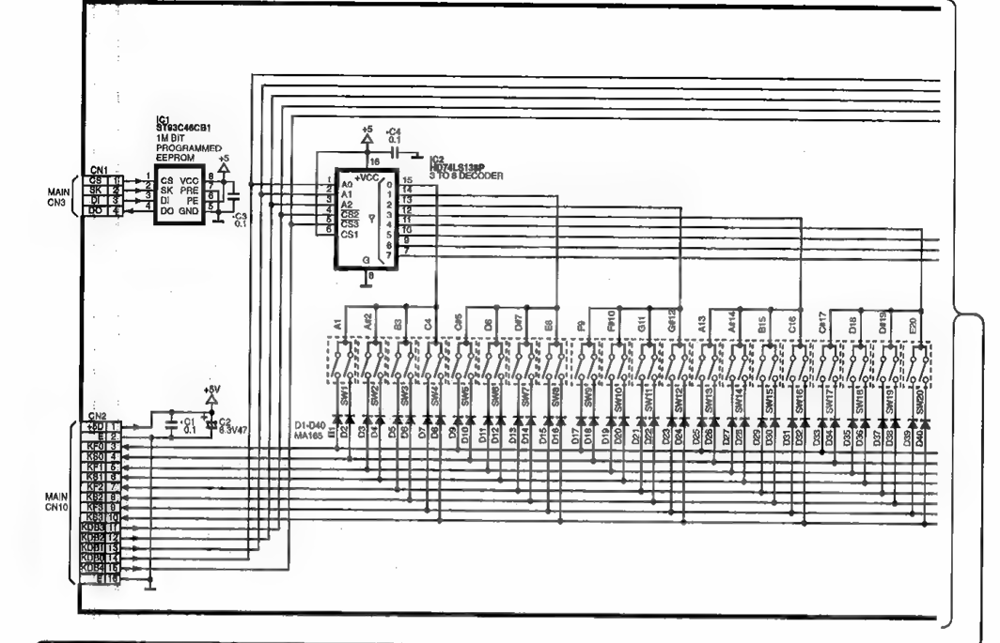
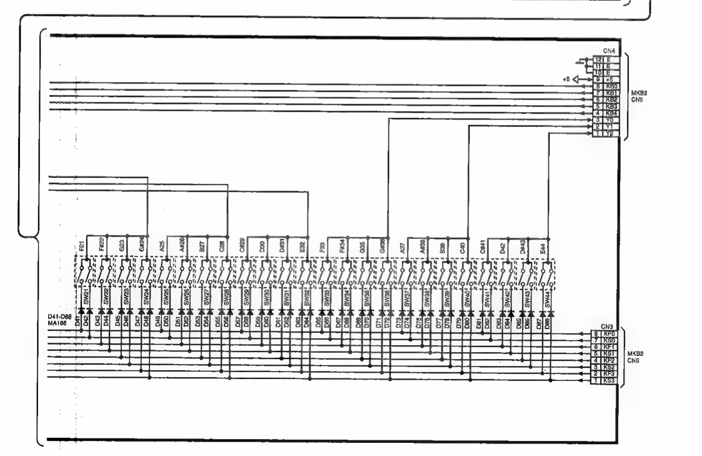

# Literatur

[Grundlagen zur Tastenerkennung](https://www.instructables.com/Adding-MIDI-to-Old-Home-Organs)  

[Reddit Diskussion](https://www.reddit.com/r/diyelectronics/comments/1mawsv1/using_original_digital_piano_speakers_with_pi)

  
Die Tasten werden über eine keypad-Matrix mit Shift-Registern angesprochen.  
Pro Klaviertaste sind zwei Taster verbaut.  

16 Pin Flachbandkabel

Pin 1: +5 V
Pin 2: GND
Pin 3,4,5,6,7,8,9,10: 8 rows
Pin 11-15: columns über Shift-Register
Pin 16: GND

## Shift-Register
HD74LS138P 
3 to 8 Decoder
8*8 = 64 Taster = 32 Tasten 
pro Decoder

Insgesamt sind 3 Decoder verbaut. Es könnten also 96 Tasten angesprochen werden.

### Verdrahtung
#### Pins zum binären Codieren der 8 Anschlüsse

14 -> 1 = A0 = A   
13 -> 2 = A1 = B  
12 -> 3 = A2 = C  

|12|13|14|Pin LOW|
|---|---|---|---|
|C|B|A|||
|0|0|0|1|
|0|0|1|2|
|0|1|0|3|
|0|1|1|4|
|1|0|0|5|
|1|0|1|6|
|1|1|0|7|
|1|1|1|8|  

Alle anderen Pins sind immer HIGH.

#### Pins zum Aktivieren der Dekoder
Die Enabled-Pins der 3 Dekoder sind unterschiedlich verdrahtet:

Dekoder 1:  
15 -> 5 = CS3      
11 -> 4 = CS2     
+5V -> 6 = CS1  

Dekoder 2:  
GND -> 4 = CS2  
15 -> 5 = CS3     
11 -> 6 = CS1   

Dekoder 3:  
GND -> 4 = CS2  
11  -> 5 = CS3  
15  -> 6 = CS1   

Der Dekoder ist aktiv, wenn CS1 HIGH und CS2 und CS3 LOW sind.

Über 11 und 15 wird jeweils nur ein Dekoder aktiviert:  

11: 0 , 15:0  
**D1: CS3 = 0, CS2 = 0, CS1 = 1**  
D2: CS3 = 0, CS2 = 0, CS1 = 0  
D3: CS3 = 0, CS2 = 0, CS1 = 0  

11: 1, 15:0  
D1: CS3 = 0, CS2 = 1, CS1 = 1  
**D2: CS3 = 0, CS2 = 0, CS1 = 1**  
D3: CS3 = 1, CS2 = 0, CS1 = 0  

11:0, 15:1  
D1: CS3 = 1, CS2 = 0, CS1 = 1  
D2: CS3 = 1, CS2 = 0, CS1 = 0  
**D3: CS3 = 0, CS2 = 0, CS1 = 1**  




## Programmierung
```C++
void loop(){
    auslesen(0,0,0);
    auslesen(0,0,1);
    auslesen(0,1,0);
    auslesen(0,1,1);
    auslesen(1,0,0);
    auslesen(1,0,1);
    auslesen(1,1,0);
    auslesen(1,1,1);
}

void auslesen(int a1,int a2, int a3){
    digitalWrite(14,a1);
    digitalWrite(13,a2);
    digitalWrite(12,a3);
    auslesen(0,0);  // Dekoder1
    auslesen(1,0);  // Dekoder2
    auslesen(0,1);  // Dekoder3
}

int[] inputPins={3,4,5,6,7,8,9,10};


void auslesen(int c1, int c2){
    digitalWrite(11,c1);
    digitalWrite(15,c2);
    int anz=0;
    for (int i=0;i<8;i++){
        Serial.print(digitalRead(pin[i]));
        Serial.print(',');
        if (digitalRead(pin[i])==LOW){
            anz++
            wert[anz]=pin[i];
        }
        Serial.println();
    }
}
```
