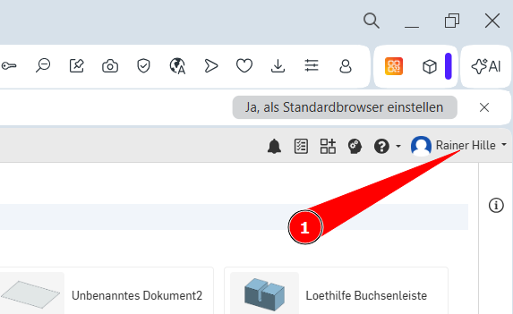
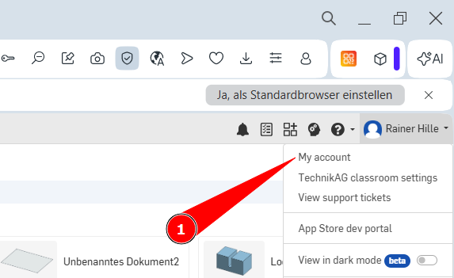
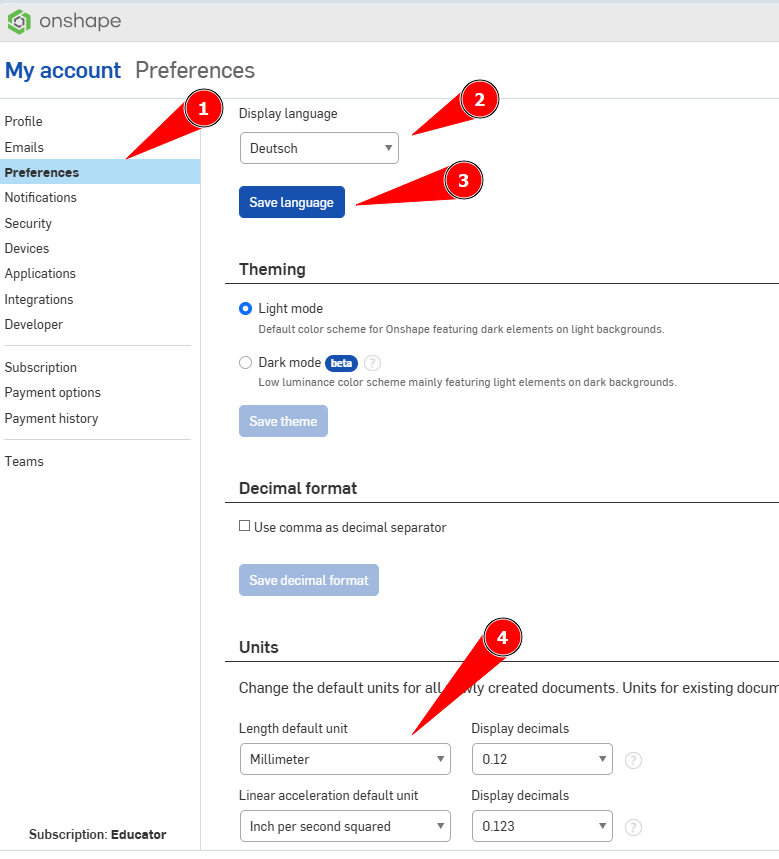

 <link rel="stylesheet" href="https://hi2272.github.io/StyleMD.css">

# Einstellen der Sprache und Einheiten in Onshape

Nach der Anmeldung kann es sein, dass 
1. die Sprache in Onshape Englisch ist.
2. **inch** als Einheiten verwendet wird.

Mit folgenden Schritten könnt ihr diese Einstellungen ändern:
1. Klickt im rechten Eck auf euren Namen:  
   
2.  Klickt im Menü auf **My account** (dt. Mein Konto)  
     
3.  Klickt im Menü auf **Preferences** (dt. Voreinstellungen)  
     
   Wählt **Deutsch** als Sprache, sowie **Millimeter** als Einheit.  
   Nach dem Speichern der Sprache müsst ihr euch wieder in Onshape anmelden.

[zurück](../index.html)  

