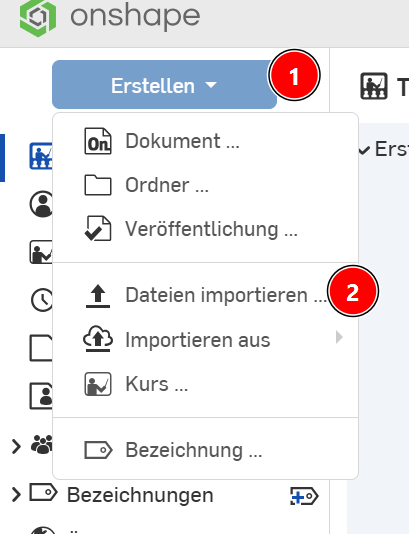
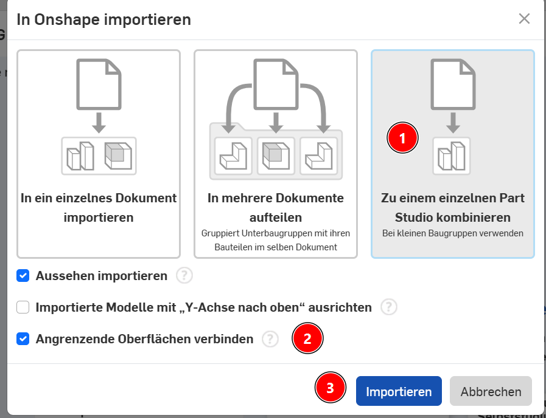

# STL-Dateien in Onshape weiterbearbeiten

## 1. STL-Dateien aus dem Internet herunterladen
https://www.thingiverse.com/

## 2. STL-Datei in STEP konvertieren
https://anyconv.com/stl-to-step-converter/

## 3. STEP-Datei in Onshape importieren
  
  

## 4. Weiter bearbeiten in Onshape
Das Objekt ist in einer neuen Datei geöffnet und kann jetzt wie jedes Onshape-Objekt weiterbearbeitet werden.