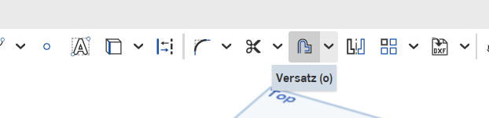

 <link rel="stylesheet" href="https://hi2272.github.io/StyleMD.css">

# Anleitung Onshape

## Arbeitsauftrag Schachtel

**Achtung:**   
Die maximale Größe unseres Druckbettes liegt bei 25x25x25 cm. Größere Objekte können nicht gedruckt werden.

### Boden
1. Zeichne ein Rechteck, das 4 mm breiter und 4mm länger ist, als die Größe die du benötigst.
2. Ziehe das Rechteck 2 mm hoch aus.
   
### Außenwände
1. Fertige eine Skizze auf der Oberfläche des Bodens an.
2. Zeichne einen Versatz von 2mm von jeder Seite nach innen

3. Ziehe den Versatz zu den vier Außenwänden aus.
   
### Zwischenwände
1. Fertige eine Skizze auf der Oberfläche des Bodens an.
2. Zeichne Rechtecke für die Zwischenwände mit einer Dicke von 2 mm
3. Ziehe alle Rechtecke zu Zwischenwänden aus.
   
### Außenwand des Deckels
1. Fertige eine Skizze auf der Oberseite der Wände an.
2. Zeichne ein Rechteck, dass genauso groß ist wie die Schachtel.
3. Zeichne einen Versatz von 1 mm in alle 4 Richtungen nach außen.  
    Dieser Abstand von 1 mm sorgt dafür, dass der Deckel leicht auf die Kiste passt.
4. Zeichne einen weiteren Versatz von 2 mm in alle vier Richtungen nach außen. Dies wird die Außenwand des Deckels.
5. Ziehe die Außenwand des Deckels 5 mm hoch aus.
### Boden des Deckels
1. Fertige eine neue Skizze auf der Oberseite der Außenwand des Deckels an.
2. Zeichen ein Rechteck, das genauso große ist wie die gesamte Außenwand des Deckels
3. Ziehe dieses Rechteck 2 mm hoch aus.

    

[zurück](../index.html)

---

<footer >

Die Schaltpläne sind mit <a href="https://www.tinkercad.com/dashboard">Tinkercad</a> erstellt.

<h5>Haftungsausschluss</h5>
  <h5>Inhalt des Onlineangebotes</h5>
  
Der Autor übernimmt keinerlei Gewähr für die Aktualität, Richtigkeit und Vollständigkeit der bereitgestellten Informationen auf unserer Website. Haftungsansprüche gegen den Autor, welche sich auf Schäden materieller oder ideeller Art beziehen, die durch die Nutzung oder Nichtnutzung der dargebotenen Informationen bzw. durch die Nutzung fehlerhafter und unvollständiger Informationen verursacht wurden, sind grundsätzlich ausgeschlossen, sofern seitens des Autors kein nachweislich vorsätzliches oder grob fahrlässiges Verschulden vorliegt. 
  Alle Angebote sind freibleibend und unverbindlich. Der Autor behält es sich ausdrücklich vor, Teile der Seiten oder das gesamte Angebot ohne gesonderte Ankündigung zu verändern, zu ergänzen, zu löschen oder die Veröffentlichung zeitweise oder endgültig einzustellen.

  <h5>Verweise und Links</h5>
  
Bei direkten oder indirekten Verweisen auf fremde Webseiten (“Hyperlinks”), die außerhalb des Verantwortungsbereiches des Autors liegen, würde eine Haftungsverpflichtung ausschließlich in dem Fall in Kraft treten, in dem der Autor von den Inhalten Kenntnis hat und es ihm technisch möglich und zumutbar wäre, die Nutzung im Falle rechtswidriger Inhalte zu verhindern. 
  Der Autor erklärt hiermit ausdrücklich, dass zum Zeitpunkt der Linksetzung keine illegalen Inhalte auf den zu verlinkenden Seiten erkennbar waren. Auf die aktuelle und zukünftige Gestaltung, die Inhalte oder die Urheberschaft der verlinkten/verknüpften Seiten hat der Autor keinerlei Einfluss. Deshalb distanziert er sich hiermit ausdrücklich von allen Inhalten aller verlinkten /verknüpften Seiten, die nach der Linksetzung verändert wurden. Diese Feststellung gilt für alle innerhalb des eigenen Internetangebotes gesetzten Links und Verweise sowie für Fremdeinträge in vom Autor eingerichteten Gästebüchern, Diskussionsforen, Linkverzeichnissen, Mailinglisten und in allen anderen Formen von Datenbanken, auf deren Inhalt externe Schreibzugriffe möglich sind. Für illegale, fehlerhafte oder unvollständige Inhalte und insbesondere für Schäden, die aus der Nutzung oder Nichtnutzung solcherart dargebotener Informationen entstehen, haftet allein der Anbieter der Seite, auf welche verwiesen wurde, nicht derjenige, der über Links auf die jeweilige Veröffentlichung lediglich verweist.

  <h5>Urheber- und Kennzeichenrecht</h5>
  
Der Autor ist bestrebt, in allen Publikationen die Urheberrechte der verwendeten Bilder, Grafiken, Tondokumente, Videosequenzen und Texte zu beachten, von ihm selbst erstellte Bilder, Grafiken, Tondokumente, Videosequenzen und Texte zu nutzen oder auf lizenzfreie Grafiken, Tondokumente, Videosequenzen und Texte zurückzugreifen. 
  Alle innerhalb des Internetangebotes genannten und ggf. durch Dritte geschützten Marken- und Warenzeichen unterliegen uneingeschränkt den Bestimmungen des jeweils gültigen Kennzeichenrechts und den Besitzrechten der jeweiligen eingetragenen Eigentümer. Allein aufgrund der bloßen Nennung ist nicht der Schluss zu ziehen, dass Markenzeichen nicht durch Rechte Dritter geschützt sind! 
  Das Copyright für veröffentlichte, vom Autor selbst erstellte Objekte bleibt allein beim Autor der Seiten. Eine Vervielfältigung oder Verwendung solcher Grafiken, Tondokumente, Videosequenzen und Texte in anderen elektronischen oder gedruckten Publikationen ist ohne ausdrückliche Zustimmung des Autors nicht gestattet.

Quelle: <a href="http://www.haftungsausschluss-vorlage.de/">Haftungsausschluss Muster</a> von <a href="http://www.haftungsausschluss.org/">Haftungsausschluss.org</a> und das <a href="http://www.dsgvo-gesetz.de/">Datenschutzgesetz</a>

</footer>