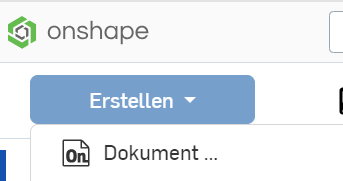
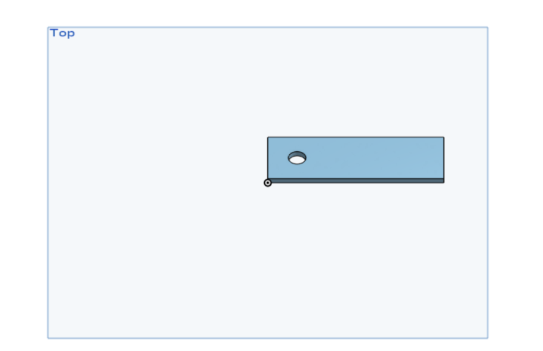
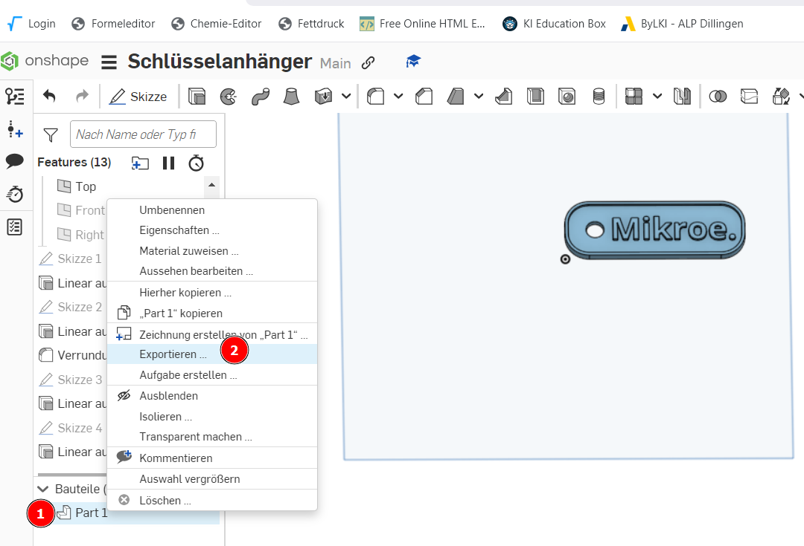

 <link rel="stylesheet" href="https://hi2272.github.io/StyleMD.css">

# Anleitung Onshape
##### [Einleitung](#1-einleitung) | [Schluesselanhänger](#2-anleitung-schluesselanhänger) | [Bilder einfügen](#3-einfügen-von-bildern) | [Schraube](#4-anleitung-schraube) | [Video-Tutorials](#5-video-tutorials)
## 1. Einleitung 
### a) Registrierung bei Onshape
Zur Arbeit mit Onshape müsst ihr euch auf dieser Seite registrieren: [onshape.com/de/sign-up](https://www.onshape.com/de/sign-up). Die Verwendung der Software ist für private Zwecke kostenlos.
### b) Anleitungsvideos zum Start
[Onshape Grundkurs 2023/1](https://youtu.be/gloEpUt8_RM?list=PLw48L7HmCgMLBuNFmJOGZYsJtjEEr83jm)  
[Übungsaufgabe](https://youtu.be/qpmfzolbTYY)  

[Schlüsselanhänger mit Symbol](https://www.youtube.com/watch?v=SL83vYpNZw4)  

### c) Erstellen eines neuen Dokuments
Melde dich auf der Internetseite von onShape an.  
Klicke auf Erstellen und wähle ein neues Dokument:  
  

Gib dem Dokument einen sinnvollen Namen und warte, bis es geladen ist.  
### d) Ausblenden der unnötigen Ebenen
Blende durch Klicks auf die Augensymbole alle Ebenen außer der Top-Ebene aus:  

### e) Vorbereiten der ersten Skizze
In Onshape zeichnen wir grundsätzlich zunächst eine Skizze in einer Ebene, die wir später in ein 3D-Objekt umwandeln.  
Wir zeichnen in der sichtbaren Top-Ebene:  
1. Klicke die Ebene an, um sie zu markieren
2. Klicke links das Symbol "Skizze" in der Menüleiste an.
3. Klicke rechts auf "oben", um die Ebene so zu drehen, dass du von oben darauf schaust.

## 2. Anleitung Schluesselanhänger
### a) Erstellen einer neuen Skizze 
### b) Zeichnen eines Rechtecks
1. Klicke im Menü das Rechteck-Symbol an.
2. Klicke den Mittelpunkt der Ebene an, um den ersten Eckpunkt zu setzen
3. Ziehe mit der Maus nach rechts oben, um das Rechteck aufzuziehen
4. Klicke mit der Maus, um den zweiten Eckpunkt zu setzen.
5. Trage 60 als Breite ein (= 60 mm) und drücke Return
6. Trage 20 als Höhe ein (=20 mm) und drücke Return.
   

### c) Umwandeln des Rechtecks in einen Quader
1. Klicke auf das Symbol "Linear austragen"
2. Trage als Wert 2 (=2 mm Dicke) ein und drücke Return.  
     
Unser Rechteck wird in einen Quader mit den exakten Maßen 60 mm x 20 mm x 2 mm umgewandelt.
### d) Bohren eines Loches
Um das Loch für den Schlüsselring zu bohren, zeichnen wir einen Kreis auf die obere Ebene des Quaders und senken diesen in das Werkstück ein.
1. Klicke die obere Ebene des Quaders an, um sie zu markieren.
2. Erstelle eine neues Skizze auf dieser Ebene.
3. Wähle des Kreis-Werkzeug.
4. Klicke auf einen beliebigen Punkt auf dem Quader, um den Mittelpunkt zu setzen.
5. Ziehe den Kreis mit der Maus auf und klicke an eine beliebigen Stelle.
6. Trage als Radius 6 ein und drücke Return.

  
Der Kreis ist blau dargestellt. Das bedeutet, dass seine Koordinaten noch nicht genau festgelegt sind. Dies können wir mit dem Bemaßungswerkzeug ändern.
1. Klicke auf das Bemaßungswerkzeug.
2. Klicke den Mittelpunkt des Kreises an.
3. Klicke die senkrechte Kante des Quaders an und ziehe die Maus nach rechts.
4. Trage als Maß 10 für 10 mm ein.
5. Klicke wieder den Mittelpunkt des Kreises an.
6. Klicke die waagrechte Kante des Quaders an und ziehe die Maus nach oben.
7. Trage wieder als Wert 10 ein.
   
Der Kreis ist jetzt schwarz dargestellt, da seine Position und sein Radius eindeutig festgelegt ist.  

  

Zum Schluss senken wir den Kreis jetzt noch ein, um eine Bohrung zu erzeugen.
1. Klicke auf das Linear Austragen-Werkzeug.
2. Wähle "Entfernen"
3. Trage als Wert 4 ein und drücke Return.
  

Das Plättchen hat jetzt eine Bohrung mit dem Radius 6 mm.  
  

Anschließend runden wir die Kanten des Anhängers ab.
1. Klicke auf das Verrundungswerkzeug.
2. Klicke die senkrechten Kanten des Quaders an.
3. Stelle als Radius 8 mm ein.
4. Klicke auf den grünen Haken, um die Verrundung durchzuführen.  

  
Jetzt beschriften wir den Schlüsselanhänger.  
1. Klicke die Oberseite des Schlüsselanhängers an und markiere damit diese Fläche.
2. Erstelle eine Skizze auf dieser Fläche.
3. Wähle das Textwerkzeug,
klicke auf die Oberfläche des Anhängers
und trage einen Namen oder eine Abkürzung (max. 5 Buchstaben) ein.
4. Wähle das Bemaßungswerkzeug und stelle die Abstände nach oben und unten so ein, dass der Text gut auf die Fläche passt. Stelle zum Loch einen Abstand von 2 mm ein.  
   
5. Wähle das Extrusionswerkzeug und ziehe den Text 1 mm weit aus.

Zum Schluss verdicken wir den Rand des Anhängers.
1. Klicke die Oberseite des Schlüsselanhängers an und markiere damit diese Fläche.
2. Erstelle eine Skizze auf dieser Fläche.
3. Wähle das Versatz-Werkzeug
4. Markiere alle Streckenteile des Randes des Anhängers.
5. Ziehe den Pfeil so, dass der Rand um 1 mm nach innen versetzt wird und drücke Return:  

6. Wähle das Extrusionswerkzeug und ziehe den Rand 1 mm weit aus.

Um das Modell drucken zu können, müssen wir es noch als STL-Datei exportieren.
1.  Klicke mit rechts auf das Part1 um Partstudio.
2.  Wähle Exportieren.  
  
Das Modell wird als STL-Datei im Download-Ordner gespeichert und kann jetzt in einem Slicer-Programm importiert werden.
## 3. Einfügen von Bildern
Bilder sind in der Regel in einem pixelbasierten Format (.jpg, .bmp, .png) gespeichert.  
### 3.1 Umwandeln in Vektor-Datei im SVG-Format
Zuerst wandeln wir diese in eine vektorbasierte SVG-Datei um. Hierzu verwenden wir das kostenlose Programm **Inkscape**:  
1. Datei importieren (Strg I)
2. Bild markieren
3. Pfad.Objekt in Pfad umwandeln  
4. Mit dem Knotenwerkzeug können wir das Ergebnis der Umwandlung noch verbessern:  
   
5. Datei speichern 
### 3.2 Umwandlen von SVG in DXF
Anschließend müssen wir die SVG-Datei in eine DXF-Datei umwandeln. Hierzu können wir ein Online-Werkzeug verwenden: https://cloudconvert.com/svg-to-dxf
### 3.3 Import in Onshape
In Onshape beginnen wir eine neue Skizze auf einer beliebigen Ebene. 
Im Skizzen-Menü gibt es ein Werkzeug zum Einfügen von DXF-Dateien:  

### 3.4 Austragen zu einer neuen Form
Unmittelbar nach dem Import tragen wir das DXF-Bild zu einer neuen Form aus:  
  

### 3.5 Anpassen der neuen Form
Wenn wir das neue Objekt markieren, können wir 
1. Das Transformieren-Menü öffnen.
2. Das Objekt verschieben
3. Das Objekt drehen
4. Das Objekt vergrößern oder verkleinern.  
   

### 3.6 Vereinigen mit der Oberfläche
Um unser neues Zeichenobjekt mit der Oberfläche des alten Objektes zu verschmelzen, müssen wir
1. Beide markieren (Strg-Taste beim Klicken gedrückt halten)
2. Die beiden Objekte über das Menü **Boolesch** vereinigen:  

## 4. Anleitung Schraube
Unter dieser Adresse kannst du eine Anleitung herunterladen:
[Onshape Tutorial](https://ap.physik.unibas.ch/PDF/Manuals/German/IIZ1.pdf)  
Sehr viel einfacher geht das Erstellen von Schrauben und Muttern aber mit dem folgenden Video-Tutorial.
## 5. Video-Tutorials
#### a) Custom Features
Custom Features sind Werkzeuge, die zu Onshape hinzugefügt werden können. In den Videos wird die Installation erklärt.

- [Video Gewinde-Werkzeug](https://youtu.be/lY9D7eie-Bg)  
Custom Feature Gewinde: 
https://cad.onshape.com/documents/6b640a407d78066bd5e41c7a/v/21ef017a4e386179c3be31f3/e/c953720c264ce001f1a82dc1     
- [Video Gitter-Werkzeug](https://youtu.be/6XbfaVHAPZ0)  
Custom Feature Gitter: 
https://cad.onshape.com/documents/d1489499c6bfdc52ce5cf32a/w/c544b659a37041d14e810028/e/1e65c10a40f2fe803e5816de
- [Video Zahnrad und Zahnstange](https://youtu.be/nDwVnotmvoE)  
Custom Feature Zahnrad:  
https://cad.onshape.com/documents/5742c8cde4b06c68b362d748/v/1db29081376c095cf10e2a3d/e/01a666571e625f8b819fd75b

#### b) Nachbearbeiten von STL-Dateien

STL-Dateien werden in Onshape als sogenannte Mesh-Objekte eingefügt. Ihre Oberfläche wird als Sammlung von Punkten (Vertices), Kanten und Flächen dargestellt. Diese Objekte können wir in Onshape nicht direkt verändern. Wir können aber auf dem Mesh-Objekt neue Ebenen und Formen anlegen, mit denen wir dann wie gewohnt arbeiten können. Die folgenden Videos zeigen das Vorgehen:  
- [Bohrung verschließen oder vergrößern](https://youtu.be/WLT_AozSL_E)  
- [Bohrung verkleinern](https://youtu.be/HNV7gATUfGo)  
- [Komplexe Operationen (englisch)](https://youtu.be/Lm_uuB9_2yg)  

[zurück](../index.html)

---

<footer >

Die Schaltpläne sind mit <a href="https://www.tinkercad.com/dashboard">Tinkercad</a> erstellt.

<h5>Haftungsausschluss</h5>
  <h5>Inhalt des Onlineangebotes</h5>
  
Der Autor übernimmt keinerlei Gewähr für die Aktualität, Richtigkeit und Vollständigkeit der bereitgestellten Informationen auf unserer Website. Haftungsansprüche gegen den Autor, welche sich auf Schäden materieller oder ideeller Art beziehen, die durch die Nutzung oder Nichtnutzung der dargebotenen Informationen bzw. durch die Nutzung fehlerhafter und unvollständiger Informationen verursacht wurden, sind grundsätzlich ausgeschlossen, sofern seitens des Autors kein nachweislich vorsätzliches oder grob fahrlässiges Verschulden vorliegt. 
  Alle Angebote sind freibleibend und unverbindlich. Der Autor behält es sich ausdrücklich vor, Teile der Seiten oder das gesamte Angebot ohne gesonderte Ankündigung zu verändern, zu ergänzen, zu löschen oder die Veröffentlichung zeitweise oder endgültig einzustellen.

  <h5>Verweise und Links</h5>
  
Bei direkten oder indirekten Verweisen auf fremde Webseiten (“Hyperlinks”), die außerhalb des Verantwortungsbereiches des Autors liegen, würde eine Haftungsverpflichtung ausschließlich in dem Fall in Kraft treten, in dem der Autor von den Inhalten Kenntnis hat und es ihm technisch möglich und zumutbar wäre, die Nutzung im Falle rechtswidriger Inhalte zu verhindern. 
  Der Autor erklärt hiermit ausdrücklich, dass zum Zeitpunkt der Linksetzung keine illegalen Inhalte auf den zu verlinkenden Seiten erkennbar waren. Auf die aktuelle und zukünftige Gestaltung, die Inhalte oder die Urheberschaft der verlinkten/verknüpften Seiten hat der Autor keinerlei Einfluss. Deshalb distanziert er sich hiermit ausdrücklich von allen Inhalten aller verlinkten /verknüpften Seiten, die nach der Linksetzung verändert wurden. Diese Feststellung gilt für alle innerhalb des eigenen Internetangebotes gesetzten Links und Verweise sowie für Fremdeinträge in vom Autor eingerichteten Gästebüchern, Diskussionsforen, Linkverzeichnissen, Mailinglisten und in allen anderen Formen von Datenbanken, auf deren Inhalt externe Schreibzugriffe möglich sind. Für illegale, fehlerhafte oder unvollständige Inhalte und insbesondere für Schäden, die aus der Nutzung oder Nichtnutzung solcherart dargebotener Informationen entstehen, haftet allein der Anbieter der Seite, auf welche verwiesen wurde, nicht derjenige, der über Links auf die jeweilige Veröffentlichung lediglich verweist.

  <h5>Urheber- und Kennzeichenrecht</h5>
  
Der Autor ist bestrebt, in allen Publikationen die Urheberrechte der verwendeten Bilder, Grafiken, Tondokumente, Videosequenzen und Texte zu beachten, von ihm selbst erstellte Bilder, Grafiken, Tondokumente, Videosequenzen und Texte zu nutzen oder auf lizenzfreie Grafiken, Tondokumente, Videosequenzen und Texte zurückzugreifen. 
  Alle innerhalb des Internetangebotes genannten und ggf. durch Dritte geschützten Marken- und Warenzeichen unterliegen uneingeschränkt den Bestimmungen des jeweils gültigen Kennzeichenrechts und den Besitzrechten der jeweiligen eingetragenen Eigentümer. Allein aufgrund der bloßen Nennung ist nicht der Schluss zu ziehen, dass Markenzeichen nicht durch Rechte Dritter geschützt sind! 
  Das Copyright für veröffentlichte, vom Autor selbst erstellte Objekte bleibt allein beim Autor der Seiten. Eine Vervielfältigung oder Verwendung solcher Grafiken, Tondokumente, Videosequenzen und Texte in anderen elektronischen oder gedruckten Publikationen ist ohne ausdrückliche Zustimmung des Autors nicht gestattet.

Quelle: <a href="http://www.haftungsausschluss-vorlage.de/">Haftungsausschluss Muster</a> von <a href="http://www.haftungsausschluss.org/">Haftungsausschluss.org</a> und das <a href="http://www.dsgvo-gesetz.de/">Datenschutzgesetz</a>

</footer>