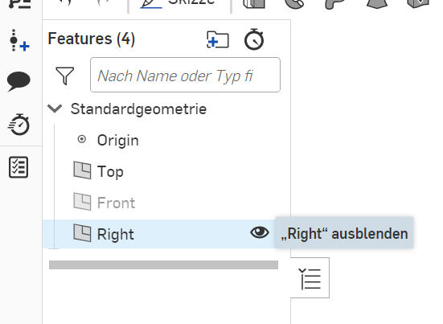
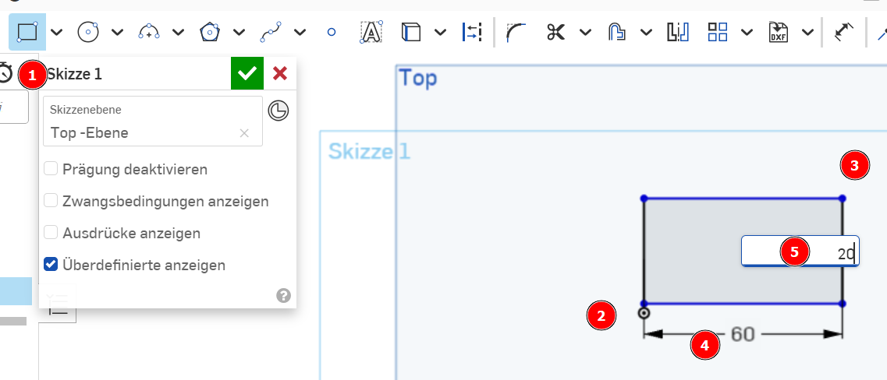
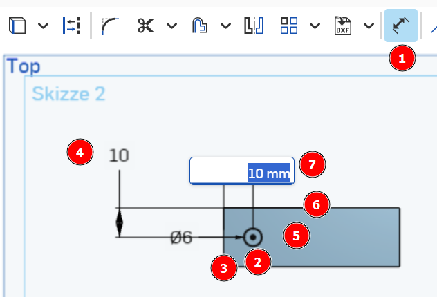

 <link rel="stylesheet" href="https://hi2272.github.io/StyleMD.css">

# Anleitung Onshape
## 1. Erstellen eines neuen Dokuments
Melde dich auf der Internetseite von onShape an.  
Klicke auf Erstellen und wähle ein neues Dokument:  
  

Gib dem Dokument einen sinnvollen Namen und warte, bis es geladen ist.  
## 2. Ausblenden der unnötigen Ebenen
Blende durch Klicks auf die Augensymbole alle Ebenen außer der Top-Ebene aus:  

## 3. Vorbereiten der ersten Skizze
In OnShape zeichnen wir grundsätzlich zunächst eine Skizze in einer Ebene, die wir später in ein 3D-Objekt umwandeln.  
Wir zeichnen in der sichtbaren Top-Ebene:  
1. Klicke die Ebene an, um sie zu markieren
2. Klicke links das Symbol "Skizze" in der Menüleiste an.
3. Klicke rechts auf "oben", um die Ebene so zu drehen, dass du von oben darauf schaust.

[zurück](../index.html)
## 4. Zeichnen eines Rechtecks
1. Klicke im Menü das Rechteck-Symbol an.
2. Klicke den Mittelpunkt der Ebene an, um den ersten Eckpunkt zu setzen
3. Ziehe mit der Maus nach rechts oben, um das Rechteck aufzuziehen
4. Klicke mit der Maus, um den zweiten Eckpunkt zu setzen.
5. Trage 60 als Breite ein (= 60 mm) und drücke Return
6. Trage 20 als Höhe ein (=20 mm) und drücke Return.
   
## 5. Umwandeln des Rechtecks in einen Quader
1. Klicke auf das Symbol "Linear austragen"
2. Trage als Wert 2 (=2 mm Dicke) ein und drücke Return.
     
Unser Rechteck wird in einen Quader mit den exakten Maßen 60 mm x 20 mm x2 mm umgewandelt.
## 6. Bohren eines Loches
Um das Loch für den Schlüsselring zu bohren, zeichnen wir einen Kreis auf die obere Ebene des Quaders und senken diesen in das Werkstück ein.
1. Klicke die obere Ebene des Quaders an, um sie zu markieren.
2. Erstelle eine neues Skizze auf dieser Ebene.
3. Wähle des Kreis-Werkzeug.
4. Klicke auf einen beliebigen Punkt auf dem Quader, um den Mittelpunkt zu setzen.
5. Ziehe den Kreis mit der Maus auf und klicke an eine beliebigen Stelle.
6. Trage als Radius 6 ein und drücke Return.

  
Der Kreis ist blau dargestellt. Das bedeutet, dass seine Koordinaten noch nicht genau festgelegt sind. Dies können wir mit dem Bemaßungswerkzeug ändern.
1. Klicke auf das Bemaßungswerkzeug.
2. Klicke den Mittelpunkt des Kreises an.
3. Klicke die senkrechte Kante des Quaders an und ziehe die Maus nach rechts.
4. Trage als Maß 10 für 10 mm ein.
5. Klicke wieder den Mittelpunkt des Kreises an.
6. Klicke die waagrechte Kante des Quaders an und ziehe die Maus nach oben.
7. Trage wieder als Wert 10 ein.
   
Der Kreis ist jetzt schwarz dargestellt, da seine Position und sein Radius eindeutig festgelegt ist.  

  

Zum Schluss senken wir den Kreis jetzt noch ein, um eine Bohrung zu erzeugen.
1. Klicke auf das Linear Austragen-Werkzeug.
2. Wähle "Entfernen"
3. Trage als Wert 4 ein und drücke Return.
  

Dsa Plättchen hat jetzt eine Bohrung mit dem Radius 6 mm.

