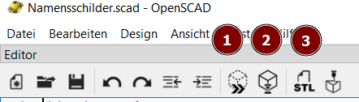

 <link rel="stylesheet" href="https://hi2272.github.io/StyleMD.css">


# OpenSCAD
## Allgemeines
OpenSCAD ist eine kostenlose CAD-Software, in der 3D-Modelle nicht gezeichnet, sondern programmiert werden.  
Sie kann unter folgender Adresse heruntergeladen werden:  
[OpenSCAD Downloads](https://openscad.org/downloads.html)
## Beispielprogramm Namensschilder


[Programm für Namensschilder](Namensschilder.scad)

Das folgende Programm erzeugt Namensschilder:

``` C++
// Liste der Namen
namen = ["Max","Muster","Martha","Mathilde","Matthias"];

// Funktion zur Erstellung eines Namensschilds
module namensschild(name) {
        // Rechteckiges Schild mit abgerundeten Ecken
       linear_extrude(height=1)
          rounded_rectangle([80, 18], 2);
      
       translate([0, 0, 1])
            linear_extrude(height = 1)
                text(name, size = 13, halign = "center", valign = "center");
}


// Funktion zur Erstellung eines Rechtecks mit abgerundeten Ecken
module rounded_rectangle(size, radius) {
    minkowski() {
        square(size - [radius * 2, radius * 2], center = true);
        circle(radius);
    }
}

// Namensschilder für alle Namen in der Liste erstellen
for (i = [0:len(namen)-1]) {
    // Berechnung der Position für zwei Spalten
    x = (i % 2) * 90; // 80 mm Breite + 10 mm Abstand
    y = floor(i / 2) * 20; // 18 mm Höhe + 2 mm Abstand
    translate([x, y, 0])
        namensschild(namen[i]);
}
```
### Erläuterungen zum Code
#### module namensschild(name) {
Module sind in OpenSCAD Unterprogramme, die im oberen Teil des Programmes definiert und im unteren aufgerufen werden. Durch das Verwenden von Modulen bleibt das eigentlichen Hauptprogramm kurz und gut lesbar.

####  linear_extrude(height=1)
Dieser Befehl extrudiert das 2D-Objekt in der folgenden Zeile um 1 mm in die Höhe. Damit entsteht aus dem abgerundeten Rechteck die Grundplatte für unser Namensschild.  

#### translate([0, 0, 1])
Mit diesem Befehl wird das folgende Objekt um 1 mm nach oben verschoben. Damit landet der folgende Text auf der Oberfläche unseres Plättchens.

#### minkowski() {
Die Minkowski-Funktion kombiniert das Rechteck und den Kreis. Das Ergebnis ist ein Rechteck mit abgerundeten Ecken.  
### Bedienung von OpenSCAD
Über dem Editor-Bereich, in dem der Code geschrieben wird, sind drei Steuerbuttons:  
  
1. **Vorschau:** Das Programm wird ausgeführt und ein 3D-Modell der Konstruktion wird dargestellt. Dieser Vorgang ist sehr schnell.   
2. **Rendern:** Die Konstruktion wird gerendert, d.h. ein exaktes 3D-Modell wird berechnet. Dieser Prozess dauert relativ lang.
3. **STL-Datei erzeugen:** Das mit Nr. 2 gerenderte Modell wird als STL-Datei exportiert.  

Unter folgender Adresse kannst du eine Anleitung für OpenSCAD herunterladen: [OpenSCAD Tutorial](https://knopper.net/fablab/OpenSCAD/OpenScad-Tutorial.pdf)   
  
## Weitere Beispiele
[Dominosteine Säuren](DominoSaeuren.scad)  
[Dominosteine Ionen](DominoIonen.scad)  
[Memory](Memory.scad)  


[zurück](../index.html)