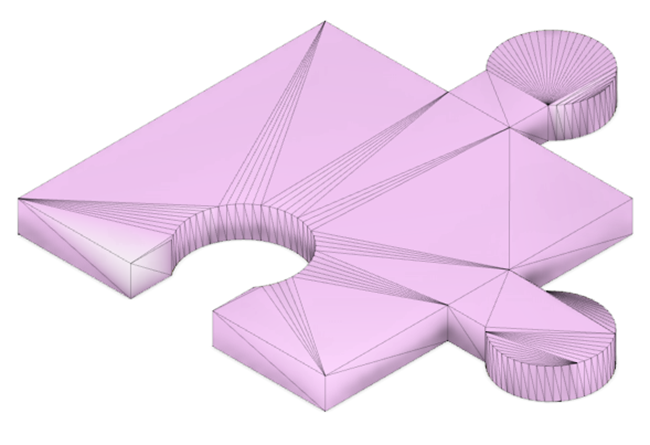

 <link rel="stylesheet" href="https://hi2272.github.io/StyleMD.css">

# 3D-Druck
## Ausstattung 
Unsere Schule verfügt über einen Drucker des Typs **Bambu Lab X1 Carbon**. Das Gerät ist mit einer Filamentwechseleinheit ausgestattet und kann somit mehrfarbig drucken. 
Die [Wilhelm-Stemmer-Stiftung](https://www.wilhelm-stemmer-stiftung.de) hat uns den Kauf dieses Hochleistungsdruckers ermöglicht.  

## 3D-Modelle aus dem Internet

Von den Seiten [Thingiverse](https://www.thingiverse.com/) und [Printables](https://www.printables.com/de) könnt ihr fertige Vorlagen zum Ausdrucken herunterladen.  
Die Dateien sind in der Regel im STL-Format gespeichert. Hier werden alle Flächen als Kombinationen von rechtwinkligen Dreiecken angenähert:  

## Konstruktion eigener 3D-Modelle
3D-Objekte werden mit CAD-Software konstruiert. Wir arbeiten mit der Software [Onshape](https://www.onshape.com/de/), die vollständig in der Cloud läuft. Aus diesem Grund muss kein Programm auf dem Rechner installiert werden und die Hardware des Rechners muss nicht besonders gut sein.  
Zur Arbeit mit Onshape müsst ihr euch auf dieser Seite registrieren: [onshape.com/de/sign-up](https://www.onshape.com/de/sign-up). Die Verwendung der Software ist für private Zwecke kostenlos.

[zurück](../index.html)
