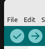

# Einrichten der Programmierumgebung
## Starten von Linux Mint vom USB-Stick aus
1. Stecke den USB-Stick in die Buchse auf der linken Seite des Rechners.
2. Schalte den Rechner ein.
3. Drücke sofort nach dem Einschalten die F12-Taste und halte sie gedrückt, bis du einen lauten Signalton hörst.  
   Der Rechner startet das Boot-Menü
4.  Wähle ubuntu...
5.  Der Rechner fährt das Linux-Betriebssystem auf dem USB-Stick hoch.
6.  Berühre während der Arbeit den Stick nicht mehr. Sobald der Rechner den Kontakt zum Linux-System verliert, stürzt er ab und muss neu gestartet werden.
## Anschluss des Arduino Unos
Schließe den Arduino mit dem blauen USB-Kabel an einer der beiden BUSB-uchsen auf der rechten Seite des Rechners an.
## Starten der Programmier-Umgebung
Doppelklicke auf das Symbol **ArduinoIDE** auf dem Desktop.  
Der Start dauert eine Weile, bitte klicke nicht zu oft auf das Symbol, sonst startest du viele Instanzen des Programms und musst noch länger warten.
## Einstellen des Arduino Unos in der Software
1. Klicke auf die Pfeilspitze rechts von *Select Board*:   

2. Wähle **Unknown /dvttyUSB0**  
   
3. Trage im Feld BOARDS **uno** ein.
4. Klicke auf **Arduino Uno** 

5. Klicke auf **OK**  

Der Arduino Uno ist jetzt angeschlossen und kann programmiert werden.  
***
## Blink - das erste Programm
Der Arduino Uno hat eine eingebaute LED. Diese ist am Pin 13 angeschlossen. Mit folgendem Programm lassen wir die LED blinken.
1. Schreibe dieses Programm ab:
```C++
void setup() {
  pinMode(13,OUTPUT);
}

void loop() {
  digitalWrite(13,HIGH);
  delay(500);
  digitalWrite(13,LOW);
  delay(500);
}
```
2. Klicke auf den Pfeil in der linken oberen Ecke, um  
   1. Das Programm in Maschinensprache zu übersetzen (Kompilieren des Programms).
   2. Den Maschinencode über das USB-Kabel auf den Mikrocontroller zu laden (Flashen des Programmcodes).  

3. Warte bis die Meldung **Done uploading** (Hochladen erfolgreich) erscheint.  
Die LED auf dem Arduino Uno blinkt jetzt schnell.

## Erläuterungen zum Code

### void setup(){  }
Die setup-Methode wird nur einmal durchlaufen, wenn der Mikrocontroller gestartet wird. In dieser Methode werden grundlegende Einstellungen für den Betrieb des Mikrocontrollers vorgenommen. 


**Merke:**   

Die geschweiften Klammern {  } umfassen den Code, der beim Aufruf der Methode ausgeführt wird. Man bezeichnet diese Einheit auch als Block im Code.


### pinMode(13,OUTPUT);
Die Anschlüsse (Pins) des Arduinos können als Eingang (**I**NPUT) und als Ausgang (**O**UTPUT) programmiert werden. Man bezeichnet sie daher auch als **IO**-Pins.  

Die Methode pinMode(13, OUTPUT) legt fest, dass der Pin 13 als Ausgang verwendet wird. (pinMode(6,INPUT) würde Pin 6 als Eingang festlegen.)

### void loop(){}
Die loop-Methode wird beim Betrieb des Arduinos immer wieder durchlaufen. Sie stellt also eine Endlosschleife dar.

### digitalWrite(13,HIGH);
Diese Methode legt am Pin 13 ein positives Potential (+5 V) an. Die mit dem Pin 13 verbundene interne LED beginnt zu leuchten.
###  delay(500);
Das Programm pausiert 500 ms lang. So lange leuchtet die LED.
### digitalWrite(13,LOW);
Der Pin 13 wird mit Masse verschaltet, d.h. sein Potential wird auf 0 V festgelegt. Die interne LED leuchtet nicht mehr, da keine Spannung mehr anliegt.
### delay(500);
Die zweite Pause bedingt, dass die LED 500 ms lang ausgeschaltet bleibt.  
Da die loop()-Methode immer wieder durchlaufen wird, beginnt sie anschließend wieder zu leuchten. Sie blinkt also ungefähr einmal pro Sekunde.

## Experimentieraufgabe

Ändere das Programm so ab, dass die LED langsamer blinkt und lade es erneut hoch.
    

   
[zurück](../index.html)