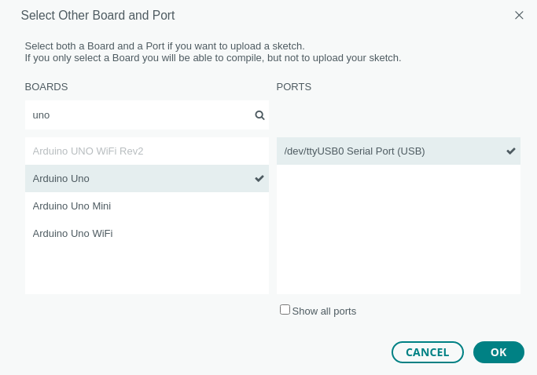

 <link rel="stylesheet" href="https://hi2272.github.io/StyleMD.css">

# Einrichten der Programmierungumgebug
## Starten von Linux Mint auf den Rechnern
1. Stecke den USB-Stick in die Buchse auf der linken Seite des Rechners.
2. Schalte den Rechner ein.
3. Warte, bis das Boot-Menü erscheint und drücke Return, um Linux Mint zu starten. 
4.  Der Rechner fährt das Linux-Betriebssystem auf dem USB-Stick hoch.
5.  Es startet automatisch zwei Programme:
    1.  Programmierumgebung für Arduinos (Arduino IDE)
    2.  Internetbrowser Firefox
6.  Berühre während der Arbeit den Stick nicht mehr. Sobald der Rechner den Kontakt zum Linux-System verliert, stürzt er ab und muss neu gestartet werden.

## Anschluss des Arduino Unos
Schließe den Arduino mit dem blauen USB-Kabel an einer der beiden Buchsen auf der rechten Seite des Rechners an.
## Einstellen des Arduino Unos in der Software
1. Klicke auf die Pfeilspitze rechts von Select Board  

2. Wähle **Unknown /dvttyUSB0**  

3. Trage im Feld BOARDS **uno** ein.  
4. Klicke auf **Arduino Uno**   

5. Klicke auf **OK**  

[zurück](../index.html)
   
