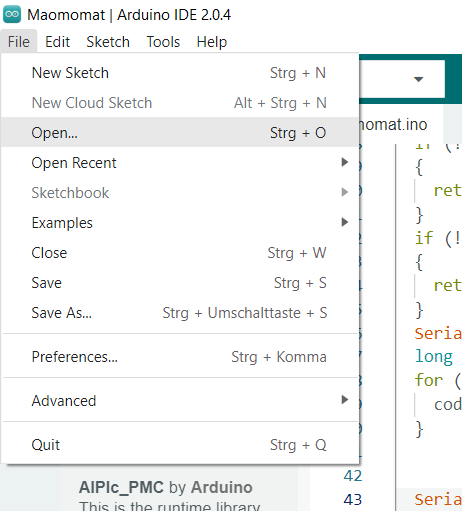
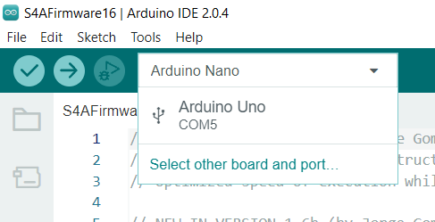
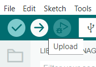

# Scratch for Arduino (S4A)
## 1. Installieren der Firmware auf dem Arduino Uno
**Scratch for Arduino (S4A)** kann einen Arduino Uno vom PC aus fernsteuern. Der Mikrocontroller reagiert direkt auf Eingaben am PC und der PC kann Messwerte vom Controller in Echtzeit weiter verarbeiten.  
Hierzu muss eine Firmware-Datei auf dem Arduino installiert werden:  

1. Schließe den Arduino Uno über das USB-Kabel an den Rechner an.
2. Starte das Programm ArduinoIDE
3. Öffne die Datei [S4AFirmware16.ino](S4AFirmware16.ino)  
   
4. Wähle den Arduino Uno als Board aus:  
   
5. Klicke auf den Pfeil, um das Programm zu compilieren und auf den Arduino zu übertragen.  
   
6. Der Arduino Uno kann jetzt mit **S4A** programmiert werden.  
Starte das Programm **S4A**.
## 2. Eine LED zum Leuchten bringen
1. Baue folgende Schaltung auf:  
     
   Jede LED muss immer mit einem Vorwiderstand geschützt werden. Sonst besteht die Gefahr, dass sie durchbrennt.
2. Erstelle in S4A ein Programm, das beim Klicken auf die grüne Fahne folgendes macht:
   1. Pin8 soll high geschaltet werden.
   2. Pin9 soll low geschaltet werden.
   3. Eine Sekunde Pause
   4. Pin8 soll low geschaltet werden.
   5. pin9 soll low geschaltet werden.
3. Verändere die Werte für Pin8 und Pin9 in Zeile 1 und 2, bis die LED leuchtet:
   |Pin8|Pin9|LED|
   |----|----|----|
   |HIGH|HIGH||
   |HIGH|LOW||
   |LOW|HIGH||
   |LOW|LOW||
4. Durch HIGH bekommt der PIN ein positives Potential (+ Pol).  
     Durch LOW bekommt er kein Potential (- POL).  
   Leite ab, unter welchen Bedingungen die LED leuchtet:  

   |Pol:|langes/kurzes Bein|   
   |-----|-----|
   |Pluspol:||
   |Minuspol:||

