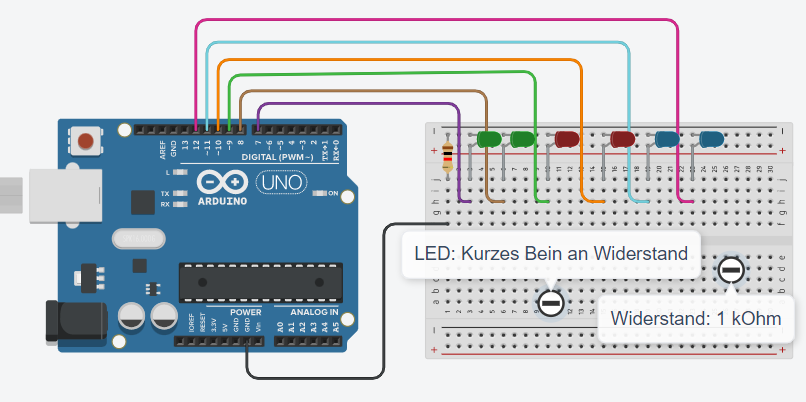

# Ein LED-Lauflicht
[Youtube Video](https://youtu.be/9zqT3V15QS0)
## 1. Schaltung
Baue diese Schaltung auf:

## 2. Programmierung
Erstelle ein Programm, mit dem die LEDs der Reihe nach
1. eingeschaltet werden,
2. 500 ms leuchten
3. ausgeschaltet werden.

[Lösung](Loesung.html)
       
[zurück](../index.html)
