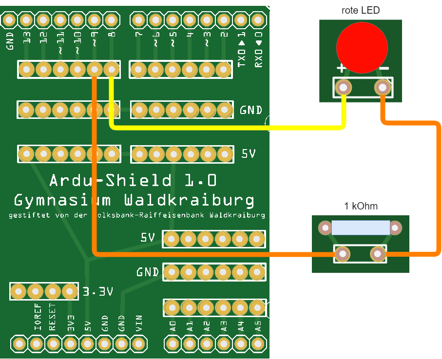

 <link rel="stylesheet" href="https://hi2272.github.io/StyleMD.css">


# Eine blinkende LED
## 1. Schaltung
Baue diese Schaltung auf:  

## 2. Programmierung
Programmiere folgenden Code:
```C++
void setup() {
  pinMode(8, OUTPUT);
  pinMode(9, OUTPUT);
  digitalWrite(9,LOW);  // Pin 9 = Minuspol der LED
}

void loop() {
  digitalWrite(8, HIGH); // Pin 8 = Pluspol -> LED ein
  delay(500);            // 500 ms Pause: LED leuchtet
  digitalWrite(8, LOW);  // Pin 8 = Minuspol -> LED aus
  delay(500);            // 500 ms Pause: LED leuchtet nicht.
}
```
## 3. Erklärung
- Die **setup-Methode läuft einmal ab**, wenn der Mikrocontroller an den Strom angeschlossen wird.  
Hier stehen Befehle, die zu Beginn ausgeführt werden müssen.   
In unserem Beispiel, wird der Pin 9 dauerhaft auf LOW geschaltet.  
- Die **loop-Methode läuft immer wieder ab.**   
Die Befehle *LED ein, Pause, LED aus, Pause* wiederholen sich solange, wie der Mikrocontroller am Strom angeschlossen ist.

## 4. Weitere Experimente
Ändere den Code so ab, dass  
1. Die LED doppelt so lang an wie aus ist.
2. Die LED doppelt so schnell blinkt.
3. Die LED so schnell blinkt, dass du das Blinken nicht mehr erkennst.  
   

[weiter zum Lauflicht](../03LEDLauflicht/index.html)  
[zurück](../index.html)
