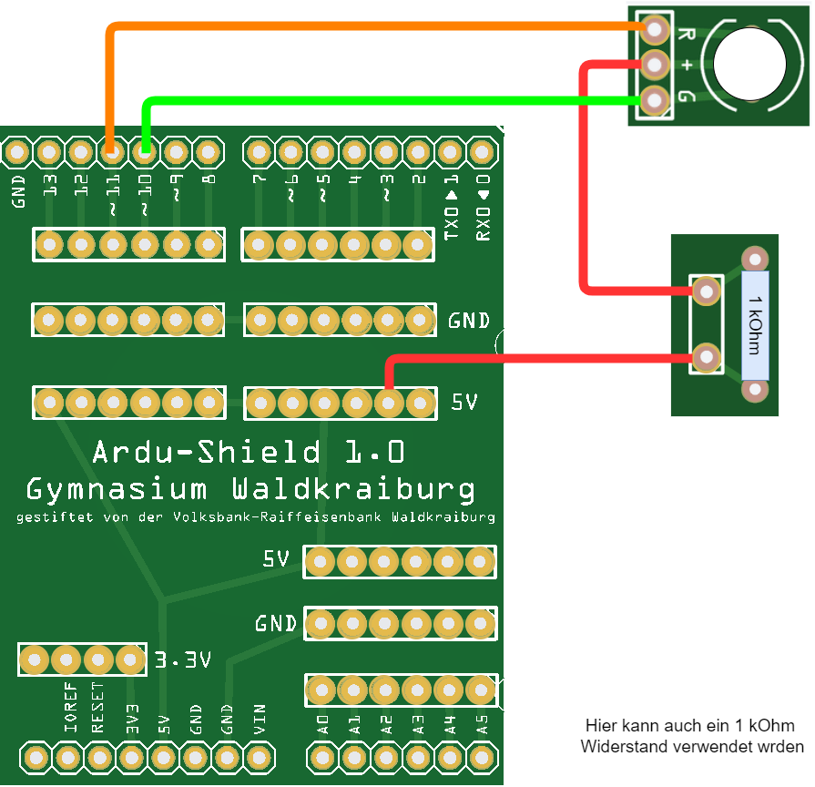
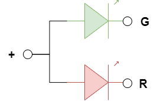

 <link rel="stylesheet" href="https://hi2272.github.io/StyleMD.css">


## 1. Die ZweifarbLED
### Baue folgende Schaltung auf:    
   
   
### Programmiere in der Arduino IDE folgenden Code:
```C++
void setup() {
  pinMode(10, OUTPUT);
  pinMode(11, OUTPUT);
  digitalWrite(10,HIGH);  // Grün aus
  digitalWrite(11,HIGH); // Rot aus  
}

void loop() {
   digitalWrite(10,LOW); // Grün an
   delay(500);
   digitalWrite(10,HIGH); // Grün aus
   digitalWrite(11,LOW); // Rot an
   delay(500);
   digitalWrite(11,HIGH); // Rot aus
}
```
### Erklärung
Die ZweifarbLED enthält in ihrem Inneren zwei winzige LEDS. Eine rote und eine grüne. Die beiden LEDs sind auf einen gemeinsamen Pluspol geschaltet:  


In unserer Schaltung wird der gemeinsame Pluspol über einen Schutzwiderstand mit +5V am Arduino verbunden.   
Der Minuspol der grünen LED (G) wird mit Pin 10 verbunden. der Befehl **digitalWrite(10,HIGH);** schaltet diesen Pin auf +5V. An beiden Polen der LED liegt damit das gleiche Potential an und die LED leuchtet nicht.  
Durch **digitalWrite(10,LOW);** wird die grüne LED eingeschaltet.  
Die rote LED wird genauso über Pin 11 geschaltet.
### Experimentieraufgabe
 Untersuche, welche Farbe du siehst, wenn beide LEDs eingeschaltet sind.


[Weiter zur DreifarbLED](../02LEDBlink/index.html)       
[zurück](../index.html)