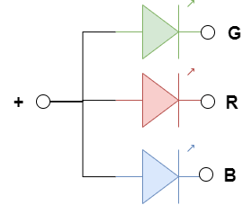
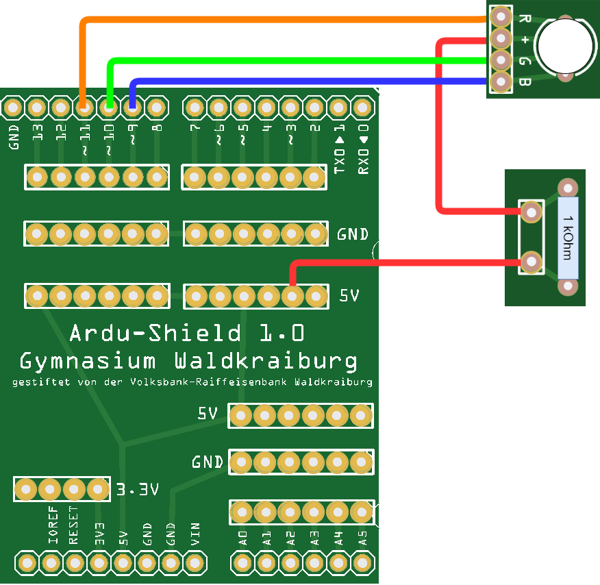

 <link rel="stylesheet" href="https://hi2272.github.io/StyleMD.css">


## Die DreifarbLED
### Schaltschema
Die DreifarbLED ist ähnlich wie eine [ZweifarbLED](../03bZweifarbLED/index.html) aufgebaut. Neben der roten und grünen enthält sie aber noch eine blaue LED:  
  
### Verkabelung

Schließe die DreifarbLED wie folgt an:  

### Programmiere in der Arduino IDE folgenden Code:
```C++
void setup() {
  pinMode(9, OUTPUT);
  pinMode(10, OUTPUT);
  pinMode(11, OUTPUT);
  digitalWrite(9,HIGH);  // Blau aus
  digitalWrite(10,HIGH);  // Grün aus
  digitalWrite(11,HIGH); // Rot aus  
}

void loop() {
   digitalWrite(9,LOW); // Blau an
   delay(500);
   digitalWrite(9,HIGH); // Blau aus
   digitalWrite(10,LOW); // Grün an
   delay(500);
   delay(500);
   digitalWrite(10,HIGH); // Grün aus
   digitalWrite(11,LOW); // Rot an
   delay(500);
   digitalWrite(11,HIGH); // Rot aus
}
```
### Experimentieraufgabe
 Untersuche, welche Farbe du siehst, wenn zwei oder drei LEDs gleichzeitig eingeschaltet sind.


[Weiter zum LED-Modul](../04LEDModul/index.html)       
[zurück](../index.html)