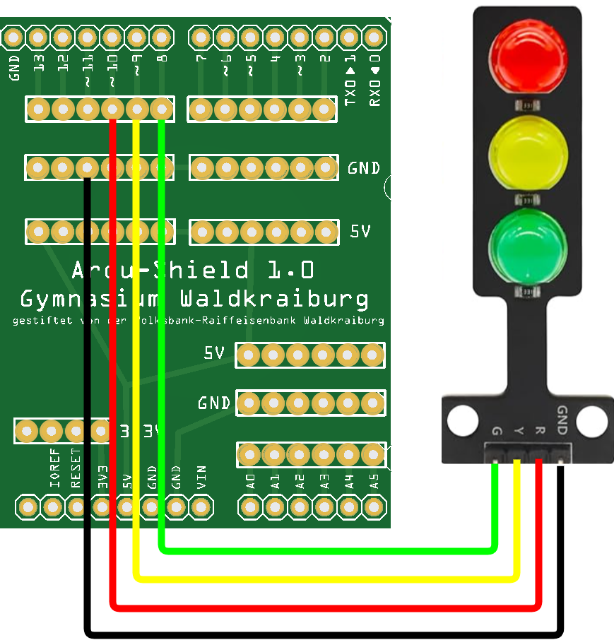

 <link rel="stylesheet" href="https://hi2272.github.io/StyleMD.css">

# Eine Ampel
## 1. Schaltung
  
## 2. Programmierung
### c) Eine echte Ampelschaltung

Erstelle dieses Schaltungsprogramm:  
 
1. nur Rot leuchtet 
2. 500 ms Pause
3. nur Gelb leuchtet
4. 500 ms Pause
5. nur Grün leuchtet
6. 500 ms Pause
7. nur Gelb leuchtet
8. 500 ms Pause

[Lösung](04Loesung.html)       
[zurück](../index.html)
