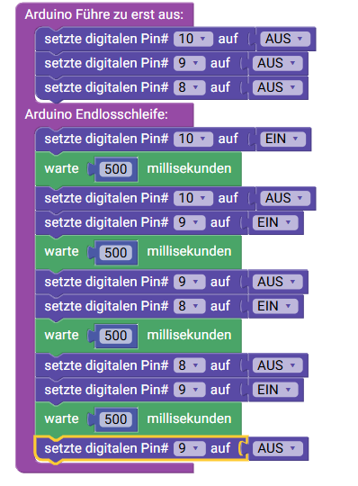

 <link rel="stylesheet" href="https://hi2272.github.io/StyleMD.css">

### Block-Code:
  
### Arduino-Code:
```c++
void setup() {
  pinMode(10, OUTPUT);
  pinMode(9, OUTPUT);
  pinMode(8, OUTPUT);

  digitalWrite(10, LOW);
  digitalWrite(9, LOW);
  digitalWrite(8, LOW);
}

void loop() {
  digitalWrite(10, HIGH);
  delay(500);
  digitalWrite(10, LOW);
  digitalWrite(9, HIGH);
  delay(500);
  digitalWrite(9, LOW);
  digitalWrite(8, HIGH);
  delay(500);
  digitalWrite(8, LOW);
  digitalWrite(9, HIGH);
  delay(500);
  digitalWrite(9, LOW);

}
```
## Experimente
Wenn die Ampel funktioniert, kannst du folgende Änderungen ausprobieren:
1. Die Rot- und Grün-Phasen sollen doppelt so lang dauern wie die Gelb-Phasen.
2. Vor dem Schalten von grün zu gelb soll die Ampel 4 x grün blinken und damit das Schalten ankündigen.  
Diese Schaltung ist in Österreich umgesetzt.

[zurück](../index.html)