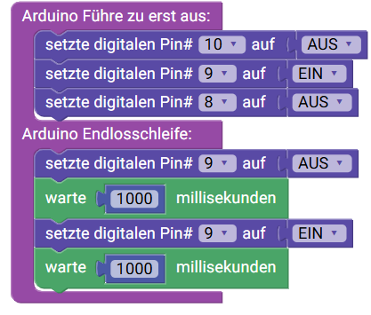

 <link rel="stylesheet" href="https://hi2272.github.io/StyleMD.css">

# Eine Ampel
## 1. Schaltung
Im Ampelmodul sind drei LEDs mit drei Vorwiderständen verbaut. Die Widerstände sind sehr kleine rechteckige Bauteile, die direkt auf die Oberfläche der Platine gelötet werden (SMD = Surface Mounted Device).  
Baue diese Schaltung auf:  
  

## 2. Programmierung
### a) Eine Lampe leuchtet
Auf der Internetseite <a href="https://sensebox.github.io/blockly/" target="_blank">https://sensebox.github.io/blockly/</a>  steht ein Editor zur blockbasierten Programmierung des Arduino Unos zur Verfügung.

1. Erstelle dieses Programm:  

2. Kopiere den Programm-Code in die Arduino-Software.
3. Lade ihn auf den Arduino hoch.
4. Welche LED an der Ampel leuchtet?

Verändere dein Programm so, dass gelbe LED leuchtet.

### b) Die gelbe Lampe blinkt
1. Erstelle dieses Programm:  

2. Kopiere den Programm-Code in die Arduino-Software.
3. Lade ihn auf den Arduino hoch.
Die gelbe LED sollte jetzt blinken

Experimentieraufgabe:

Ändere den Arduino-Code so ab, dass die gelbe Lampe schneller blinkt.

### c) Eine echte Ampelschaltung

Erstelle dieses Schaltungsprogramm:  
 
1. nur Rot leuchtet 
2. 500 ms Pause
3. nur Gelb leuchtet
4. 500 ms Pause
5. nur Grün leuchtet
6. 500 ms Pause
7. nur Gelb leuchtet
8. 500 ms Pause

[Lösung](Loesung.html)
       
[zurück](../index.html)
