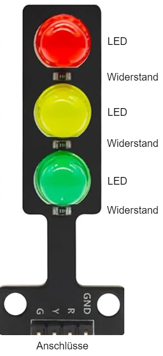

 <link rel="stylesheet" href="https://hi2272.github.io/StyleMD.css">

# Eine Ampel
## 1. Schaltung
Im Ampelmodul sind drei LEDs mit drei Vorwiderständen verbaut. Die Widerstände sind sehr kleine rechteckige Bauteile, die direkt auf die Oberfläche der Platine gelötet sind. Diese Technik nennt man SMD-Technik (SMD = Surface Mounted Device).  
  

### Experimentieraufgaben
Schließe das Ampelmodul so an die +5V und die GND-Pins auf dem ArduShield an, dass alle drei Lichter leuchten.

[Lösung](01Loesung.html)
       
[zurück](../index.html)
