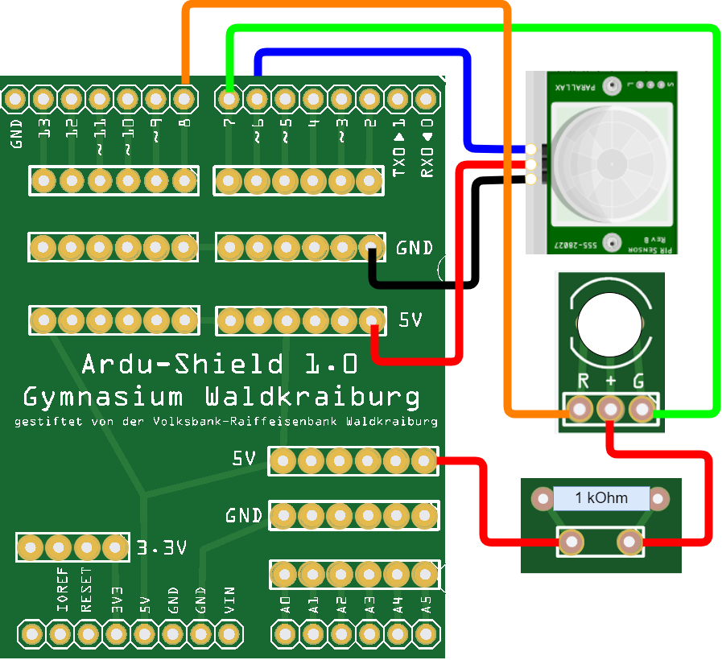

 <link rel="stylesheet" href="https://hi2272.github.io/StyleMD.css">

## 4. Die Zweifarb-LED
Wenn die Alarmanlage eingeschaltet ist, soll die LED grün leuchten.  
Sobald eine Bewegung wahrgenommen wird, soll die Farbe der LED von grün auf rot wechseln.  
### Die Schaltung
Baue eine Zweifarb-LED ein und schließe die 3 Beinchen wie folgt an:
  
  

### Der Programmcode
Ändere dein Programm wie folgt ab:
1. Deklariere zwei Variablen für die LED-Pins:
   1. ledRot = 8
   2. ledGruen = 7
2. Setze in der **setup()**-Methode den pinMode der beiden LED-Pins auf **OUTPUT**
3. Ändere die Sequenz, die ausgeführt wird, wenn eine Bewegung wahrgenommen wird:
   1. Die grüne LED soll ausgeschaltet werden.  
      Hierzu muss der Pin auf **HIGH** gestellt werden.  
      (Beide Pole der LED sind jetzt HIGH. Es liegt also kein Spannungsunterschied vor und kein Strom fließt.)
   2. Die rote LED soll eingeschaltet werden.  
   Hierzu muss der Pin auf **LOW** gestellt werden.
4. Ändere die Sequenz, die ausgeführt wird, wenn keine Bewegung wahrgenommen wird:
   1. die rote LED soll ausgeschaltet werden.
   2. die grüne LED soll eingechaltet werden.
5. Teste deine Alarmanlage

[Lösung](loesung.html)  

[zurück](../index.html)

***

<footer style="font-size:x-small;text-align: center;
    padding: 10px;
    margin: 10px;
    height: 10%;
    ">

  Die Schaltpläne sind mit <a href="https://www.tinkercad.com/dashboard">Tinkercad</a> erstellt. 
</footer>