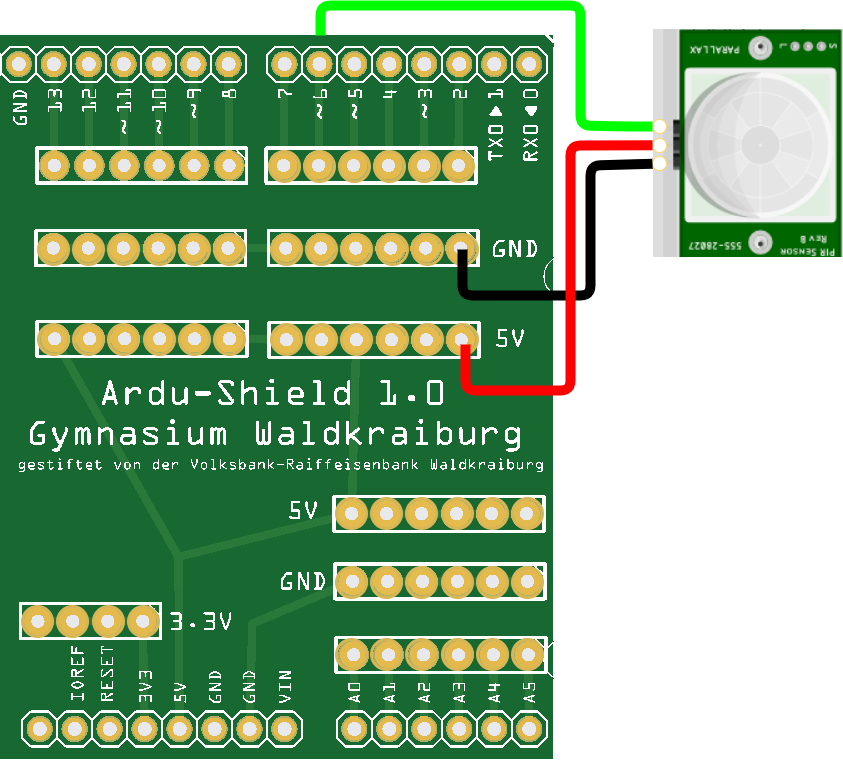
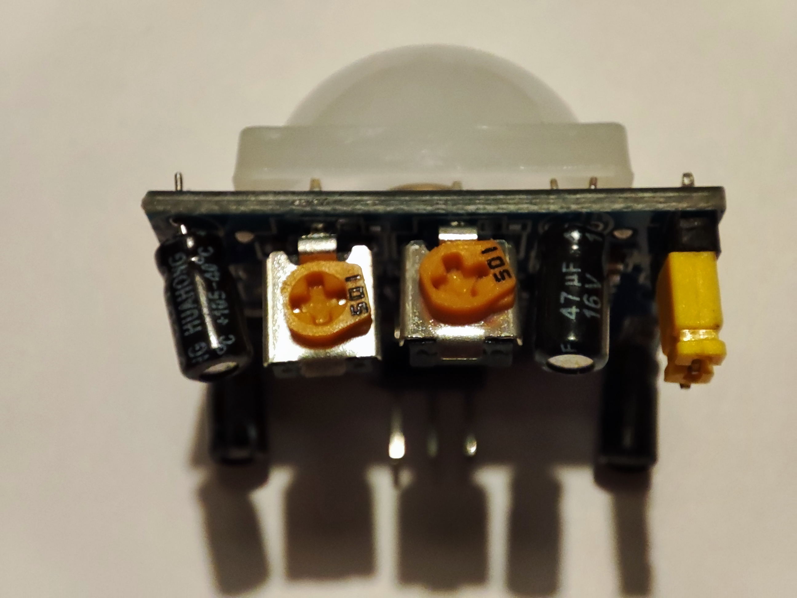

 <link rel="stylesheet" href="https://hi2272.github.io/StyleMD.css">


# Der Bewegungsmelder
Der PIR-Sensor gibt über einen Pin ein Signal aus, sobald er eine Bewegung registriert.
## 1. Die Schaltung
Die Pins des PIR-Sensors sind meistens unter der weißen Plastikhaube beschriftet. Diese Haube ist nur aufgesteckt - du kannst sie vorsichtig nach oben abziehen.  
Verbinde jetzt die Pins passend zur Beschriftung:

1. GND -> GND
2. VCC -> +5V
3. OUT -> Pin 6  

  


Auf der Vorderseite des Sensor befinden sich zwei orange Potentiometer:  
  
- Das linke regelt die Ausschaltverzögerung des Sensors.
- Das rechte regelt seine Empfindlichkeit.  
  
Sie können mit einem kleinen Schraubenzieher verstellt werden. 
- Drehe beide Potentiometer gegen den Uhrzeigersinn auf den minimalen Wert.

## 2. Der Code
Definiere zunächst für den Sensor-Pin eine Variable und setze in der  **setup()**-Methode diesen Pin als Eingang. 
Außerdem schalten wir den seriellen Monitor ein und stellen seine Datenrate auf 9600 Baud. Die serielle Schnittstelle überträgt jetzt maximal 9600 Zeichen pro Sekunde.

```C++
int sensor = 6;

void setup(){
    pinMode(sensor,INPUT);
    Serial.begin(9600);
}

```
In der **loop()**-Methode wird der Wert des Sensors ausgelesen.  
Wenn dieser Wert **HIGH** ist, wird eine entsprechende Nachricht über die serielle Schnittstelle ausgegeben.
```C++
void loop(){
    int wert=digitalRead(sensor);
    if (wert==HIGH){
        Serial.println("Bewegung");
        delay(1000);
    } 
    delay(10);
}
``` 
## 3. Der Test
Teste deine Alarmanalage. Nach dem Hochladen des Programms musst du den Seriellen Monitor einschalten:  
  

[weiter zur ZweifarbLED](012FarbLED.html)

[zurück](../index.html)

