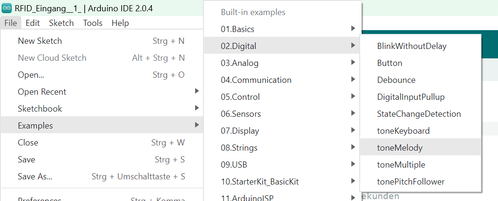

 <link rel="stylesheet" href="https://hi2272.github.io/StyleMD.css">


# Musik mit dem passiven Buzzer

In der Arduino-Software ist unter **Beispiele.02.Digital.toneKeyboard** ein Sketch gespeichert, bei dem echte Melodien programmiert werden.

  

Wenn du diese Datei öffnest, öffnet sich automatisch die Bibliothek **pitches.h**.  
In dieser Datei sind für bestimmte Notenwerte die passenden Frequenzen gespeichert:  
```C++
#define NOTE_B0 31
#define NOTE_C1 33
#define NOTE_CS1 35
...
```
Schau dir einfach das Beispielprogramm an und lade es auf den Arduino hoch.  


[zurück](../index.html)