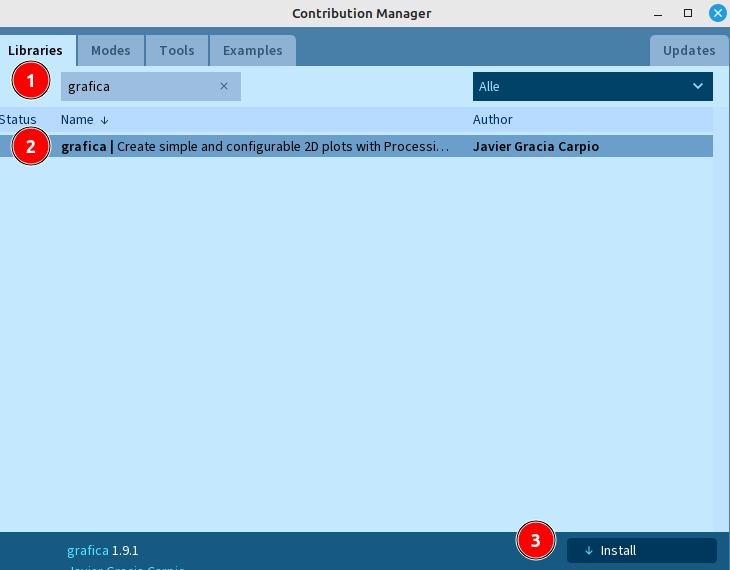

 <link rel="stylesheet" href="https://hi2272.github.io/StyleMD.css">
 
 # Diagramme aus Messdaten
 ## 1. Import der Grafica-Bibliothek
 Auch zur Darstellung der Messwerte in einem Diagramm verwenden wir eine vorgefertigte Bibliothek. 

 Öffne das Menü **Sketch.Library importieren.Manage Libraries**  

1. Trage im Suchfeld den Begriff **grafica** ein.  
2. Wähle die **grafica...**-Bibliothek aus.
3. Klicke auf Installieren:  



## 2. Einbinden der Bibliothek in den Sketch
Erstelle einen neuen Sketch und importiere in der ersten Zeile die Bibliothek:  
```Java
import grafica.*;
```

## 3. Aufbau eines einfachen Diagramms
In der **setup()**-Methode kannst du mit wenigen Zeile ein einfaches Diagramm erzeugen.
```Java
import grafica.*;

GPlot plot;

void setup() {
  size(500, 350);
  background(0, 0, 0);

  plot=new GPlot(this, 25, 25);
  plot.setTitleText("Temperaturmessung");
  plot.getXAxis().setAxisLabelText("Zeit in Sekunden");
  plot.getYAxis().setAxisLabelText("Temp. in °C");
  plot.setXLim(0, 100);
  plot.setYLim(-30, 110);
  plot.defaultDraw();
}
```
### Erklärung einzelner Code-Zeilen

### GPlot plot;
Das Objekt **plot** verweist auf das Diagramm, das wir zeichnen werden.
###  plot = new GPlot(this,25,25);
Mit dieser Zeile wird das **plot**-Objekt erzeugt (=initialisiert). Die Parameter haben folgende Bedeutung:
- this: Das Diagramm steht in diesem Programm.
- 25, 25: Seine linke obere Ecke hat die Koordinaten x=25 und y=25.
###   plot.setXLim(0, 100);
Hier legen wir die linke und rechte Grenze der x-Achse fest.
### plot.defaultDraw();
Abschließend wird das Diagramm gezeichnet:  

## 4. Darstellen von Messpunkten.
In der **draw()**-Methode fügen wir jetzt einfache Messwerte hinzu und lassen sie grafisch darstellen:
```Java
int x=0;
void draw() {
  while (x<100) {
    x++;
    plot.addPoint(x, x);
    plot.defaultDraw();
  }
}
```

## 5. Erfassen der Zeit
Bisher werden die Punkte so schnell hochgezählt, dass wir nicht sehen, wie die Kurve am Bildschirm entsteht.  
Processing liefert einfache Methoden, um die Uhrzeit des Computers abzufragen:  
- hour(): aktuelle Stunde: 0-23
- minute(): aktuelle Minute: 0-59
- second(): aktuelle Sekunde: 0-59
Mit diesem Methoden erstellen wir jetzt eine Methode, die die akutelle Zeit in Sekunden ausgibt.
``` Java
int sekunden() {
  return hour()*3600+minute()*60+second();
}
```
Wenn wir die Startzeit unseres Programms in einer Variable speichern, können wir jederzeit den x-Wert als Differenz aus der aktuellen Zeit und der Startzeit berechnen.
1. Definiere zwei neue Attribute vom Typ int zum Speichern von Zeitpunkten:  
``` Java
int startZeit;
int aktuelleZeit;
```
2. Initialisere diese beiden Attribute in der **setup**-Methode mit den Werten der Methode **sekunden()**:
``` Java
startZeit=sekunden();
aktuelleZeit=sekunden();
``` 
3. Schreibe die **draw**-Methode so um, dass immer dann ein Wert gezeichnet wird, wenn sich die Zeit verändert hat:
``` Java
void draw() {
  if (aktuelleZeit<sekunden()) {
    aktuelleZeit=sekunden();
    int x=aktuelleZeit-startZeit;
    plot.addPoint(x, x);
    plot.defaultDraw();
  }
}
```
Wenn du das Programm startest, müsste jede Sekunde ein neuer Messpunkt auf der Gerade erscheinen.  
Zur Kontrolle ist hier noch einmal der gesamte Code dargestellt:  
``` Java
import grafica.*;

GPlot plot;

int startZeit;
int aktuelleZeit;

int sekunden() {
  return hour()*3600+minute()*60+second();
}

void setup() {
  size(500, 350);
  background(0, 0, 0);

  plot=new GPlot(this, 25, 25);
  plot.setTitleText("Temperaturmessung");
  plot.getXAxis().setAxisLabelText("Zeit in Sekunden");
  plot.getYAxis().setAxisLabelText("Temp. in °C");
  plot.setXLim(0, 100);
  plot.setYLim(-30, 110);
  plot.defaultDraw();
  
  startZeit=sekunden();
  aktuelleZeit=sekunden();
}

void draw() {
  if (aktuelleZeit<sekunden()) {
    aktuelleZeit=sekunden();
    int x=aktuelleZeit-startZeit;
    plot.addPoint(x, x);
    plot.defaultDraw();
  }
}
```


[weiter](GraficaII.html)  

[zurück](../index.html)


    
