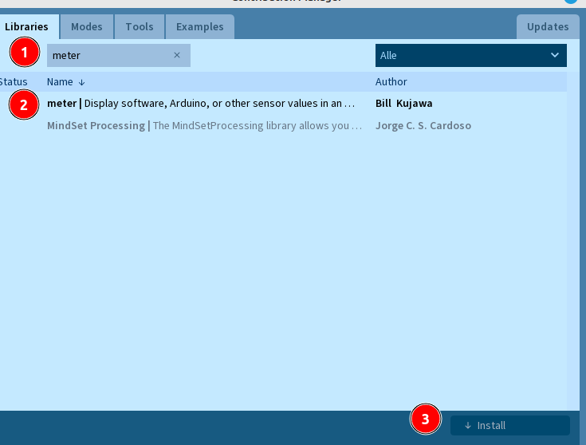
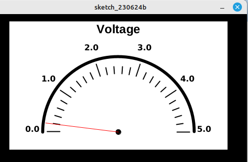

 <link rel="stylesheet" href="https://hi2272.github.io/StyleMD.css">

# Darstellung der Daten in Processing
Der Serielle Monitor und der Serielle Plotter sind einfache Werkzeuge, um Daten des Arduinos am Computer darzustellen.  
Mit Hilfe der Programmiersprache **Processing** können die Daten sehr viel schöner angezeigt werden.
## 1. Einführung in Processing
1. Starte das Programm Processing.
2. Klicke den Startbildschirm weg.
3. Schreibe folgenden Rumpf für deinen Processing-Sketch:  
```Java
// Läuft einmal ab
void setup(){
  
}

// Läuft wiederholt ab
void draw(){
  
}
```
Der Sketch ähnelt dem eines typischen Arduino-Programms. Die **loop**-Methode heißt in Processing allerdings **draw**-Methode. Sie verhält sich aber genauso.
## 2. Import der Meter-Bibliothek
Zur grafischen Darstellung der Messwerte verwenden wir die **Meter**-Bibliothek von Processing.  
Öffne das Menü **Sketch.Library importieren.Manage Libraries**
1. Trage im Suchfeld den Begriff **meter** ein.
2. Wähle die **meter|Display...**-Bibliothek aus.
3. Klicke auf Installieren:  
   
  
## 3. Einbinden der Bibliothek in den Sketch
Schreibe oberhalb der **setup**-Methode folgende Zeile, um die Bibliothek mit allen Unterklassen in den Sketch zu laden:  
```Java
import meter.*;
```
## 4. Erstellen eines Meter-Objekts
Mit folgender Zeile erstellst du ein Objekt der Klasse **Meter**:
```Java
Meter m;
```
## 5. Aufbau eines Fensters mit einer analogen Anzeige
Ergänze deinen Sketch um folgende Zeilen:  
```Java
import meter.*;

Meter m;

// Läuft einmal ab
void setup() {
  size(500, 400);
  background(0, 0, 0);
  m=new Meter(this, 25, 10);
}

int wert=0;

// Läuft wiederholt ab

void draw() {
  wert=wert+1;
  if (wert>255) {
    wert=0;
  }
  m.updateMeter(wert);
  delay(10);
}
```
### Erklärungen des Codes
#### 1. size(500,400)  
Öffnet ein Programmfenster, dass 500 Pixel breit und 400 Pixel hoch ist.
#### 2. background(0,0,0);
Stellt die Hintergrundfarbe des Fensters auf schwarz ein.
#### 3. m=new Meter(this,25,10);
Erzeugt ein neues Anzeigeobjekt, 
1. das in diesem Programmfenster anzeigt wird (this).
2. dessen linke obere Ecke an der Position x=25, y=10 (25,10) liegt.
#### 4. m.updateMeter(wert);
Es wird der aktuelle Wert der Variable wert auf der Anzeige dargestellt.  
Die Werte laufen hierbei von 0 bis 255. 
#### 5. delay(10);
Es wird eine Pause von 10ms eingelegt.

Wenn du das Programm startest, sollte folgende Anzeige erscheinen und der Wert sollte von 0,0 bis 5,0 Volt steigen:    

 
