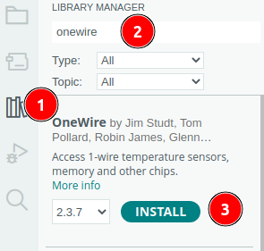

 <link rel="stylesheet" href="https://hi2272.github.io/StyleMD.css">

# Temperaturmessung mit dem DS18B20-Sensor
##  1. Anschluss
Der DS18B20-Sensor verfügt über 3 Anschluss-Kabel.  
 Schließe diese wie folgt an den Arduino an:  
  

## 2. Installation der OneWire-Biblitothek
Über das gelbe Kabel wird der Messwert bei diesem Sensor nicht als einfacher Spannungswert ausgegeben. Der Sensor liefert statt dessen nach dem OneWire-Protokoll codierte Daten.  
Um sie verarbeiten zu können, müssen wir die entsprechende Bibliothek installieren.  
1. Öffne den Bibliotheksmanager: 
2. Suche nach **OneWire**.
3. Installiere die OneWire-Bibliothek von Jim Studt:    
     

## 3. Installation der DS18B20-Bibliothek
Der DS18B20-Sensor wurde von der Firma Dallas Semiconductors entwickelt. Die Bibliothek heißt daher **DallasTemperature**:
1. Öffne den Bibliotheksmanager:
2. Suche nach **dallas**
3. Installiere die Bibliothek von Miles Burton:  
   

## 4. Programmieren des Sensors
Erstelle einen neuen Sketch und speichere ihn unter dem Namen Temperatur.
### 1. Import der Bibliotheken
Kopiere folgende Codezeilen an den Beginn deines Sketeches:
```C++
#include <OneWire.h>
#include <DallasTemperature.h>
```
### 2. Festlegen des Datenports
Mit folgenden Sketchzeilen legst du fest, dass der Sensor an Pin2 des Arduinos angeschlossen ist:
```C++
// Anschluss des Sensors an Pin2
int tempPin=2;
OneWire oneWire(tempPin);
DallasTemperature sensors(&oneWire);
```
### 3. setup()-Methode
In der **setup()**-Methode startest du die serielle Datenübertragung und den Sensor:
```C++
void setup()
{
  Serial.begin(9600);
  sensors.begin();
}
```

### 4. loop()-Methode
In der **loop()**-Methode wird alle 100ms ein Temperatur-Wert gelesen und an die Serielle Schnittstelle ausgegeben:  
```C++

void loop(void)
{ 
  // Sende Signal zum Abfragen der Temperatur
  sensors.requestTemperatures(); 
  // Lese den Wert des Sensors mit dem Index 0 (es können mehrere Sensoren angeschlossen werden)
  float tempC = sensors.getTempCByIndex(0); 
  // Ausgabe des Wertes an die Serielle Schnittstelle
  Serial.println(tempC);
  // 100 ms Pause 
  delay(100); 
}
```

### 5. Testen des Programms
Wenn du das Programm gestartet hast, wird die gemessene Temperatur in °C auf dem Seriellen Monitor ausgegeben.  
Ein Wert von -127.0 zeigt hierbei an, dass ein Fehler vorliegt - überprüfe den Code und die Verkabelung des Sensors.

### 6. Grafische Darstellung der Messwerte
Über den Seriellen Plotter kannst du die Messwerte grafisch darstellen lassen:  
  

### 7. Ausgabe der Messwerte am OLED-Display
[OLED-Display](OLED/index.html)


