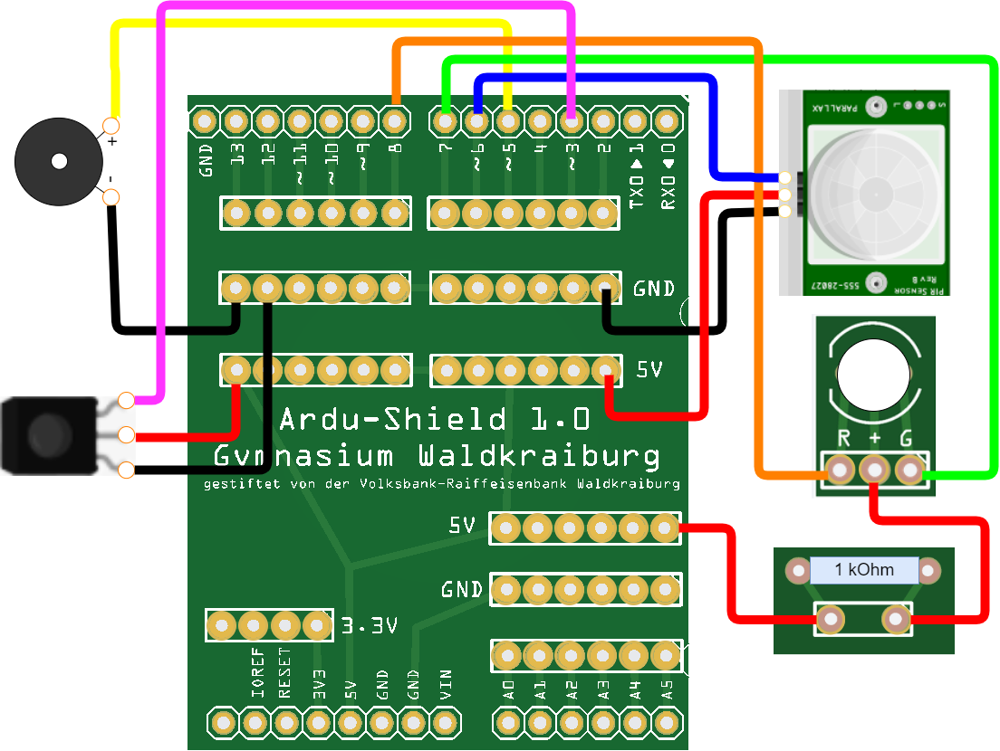

# Die Infrarot-Fernbedienung
Zum Abschluss wollen wir unsere Alarmanlage über eine Fernbedienung ein- und ausschalten können.
## 1. Die Schaltung
Eine typische Fernbedienung für einen Fernseher sendet unsichtbare Infrarot-Strahlen (IR-Strahlen) aus. Im Fernseher ist ein IR-Empfänger eingebaut, der die Strahlen aufnimmt. Der Fernseher dekodiert anschließend das gesendete Signal und reagiert entsprechend.  
Stecke zunächst den IR-Empfänger auf das Steckbrett und verkabele es wie folgt:
1. +Pol auf +5V
2. -Pol auf GND
3. S (Signal) auf Pin 3  
   
  
## 2. Der Code

1. Definiere eine neue Variable fern vom Typ int und belege sie mit dem Wert 3 vor.
2. Setze in der **setup()**-Methode den pinMode des Pins fern auf **INPUT**.
3. Starte die serielle Übertragung durch den Befehl **Serial.begin(9600)** in der **setup()**-Methode.  
   Der Parameter 9600 gibt hierbei die Übertragungsrate in Baud an. Ein Baud entspricht einer Übertragungsrate von 1 Symbol pro Sekunde. In unserem Fall werden also 9600 Symbole pro Sekunde übertragen.  

[Lösung](loesung.html)  

[zurück](../index.html)
***

<footer style="font-size:x-small;text-align: center;
    padding: 10px;
    margin: 10px;
    height: 10%;
    ">

  Die Schaltpläne sind mit <a href="https://www.tinkercad.com/dashboard">Tinkercad</a> erstellt. 
</footer>
