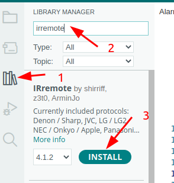
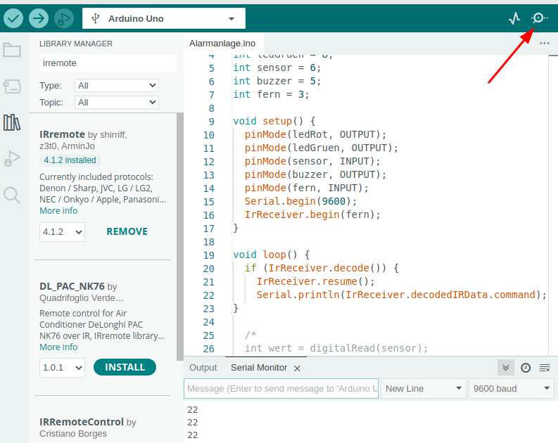

```C++
int ledRot = 7;
int ledGruen = 8;
int sensor = 6;
int buzzer = 5;
int fern=3;

void setup() {
  pinMode(ledRot, OUTPUT);
  pinMode(ledGruen, OUTPUT);
  pinMode(sensor, INPUT);
  pinMode(buzzer, OUTPUT);
  pinMode(fern,INPUT);
  Serial.begin(9600);
}
```
Für die Dekodierung der IR-Signale verwenden wir die Bibliothek **irremote** von **shirriff**.  
Um diese zu installieren, gehe wie folgt vor:  
1. Öffne die Bibliotheksverwaltung.
2. Tippe den Begriff **irremote** in die Suchmaske ein.
3. Klicke auf **Install**, um die Bibliothek herunterzuladen und zu installieren:  
     

Anschließend müssen wir die Bibliothek noch in unser Programm einbinden. Füge dazu folgende Zeile zu Beginn deines Programmes ein:  
```C++
#include <IRremote.h>
```
In der **setup()**-Methode starten wir den IR-Empfänger mit folgender Code-Zeile:  
```C++
  IrReceiver.begin(fern);
```

Um die Fernbedienung zu testen, kommentieren wir den gesamten Inhalt der **loop()**-Methode durch /* und */ aus.


Unser gesamter Code sieht bisher wie folgt aus:
```C++
#include <IRremote.h>

int ledRot = 7;
int ledGruen = 8;
int sensor = 6;
int buzzer = 5;
int fern = 3;

void setup() {
  pinMode(ledRot, OUTPUT);
  pinMode(ledGruen, OUTPUT);
  pinMode(sensor, INPUT);
  pinMode(buzzer, OUTPUT);
  pinMode(fern, INPUT);
  Serial.begin(9600);
  IrReceiver.begin(fern);
}

void loop() {
  /*
  int wert = digitalRead(sensor);
  if (wert == HIGH) {
    digitalWrite(ledGruen, HIGH);
    digitalWrite(ledRot, LOW);
    tone(6, 500);
    delay(500);
    tone(6, 700);
    delay(500);
    noTone();
  } else {
    digitalWrite(ledGruen, LOW);
    digitalWrite(ledRot, HIGH);
  }
  */
}```
In der ersten Zeile der **loop()**-Methode fügen wir jetzt folgenden Code-Block ein:  
```C++
if (IrReceiver.decode()) {
    IrReceiver.resume();
    Serial.println(IrReceiver.decodedIRData.command);
}
```
Der Code bewirkt folgendes:
1. Wenn ein Signal der Fernbedienung empfangen wird,
2. wird der Empfänger zurückgesetzt, damit er weiter Daten lesen kann und
3. der Code des Signals wird an die serielle Schnittstelle ausgegeben.
   
Um den Code zu testen, müssen wir ihn kompilieren und auf den Arduino hoch laden. Im Anschluss öffnen wir den Seriellen Monitor.

Jetzt müssen wir nur noch testen, welche Taste auf der Fernbedienung welchen Code erzeugt.  
Erstelle hierzu eine Tabelle auf einem Blatt Papier.  
**Anmerkung:**  
Mit diesem Versuchsaufbau kannst du die Codes beliebiger Fernbedienungen auslesen. Du kannst zum Beispiel untersuchen, welche Codes deinen Fernseher steuern.  
[Weiter](weiter.html)  


[zurück](../index.html)