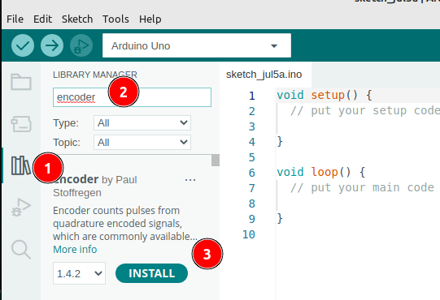

 <link rel="stylesheet" href="https://hi2272.github.io/StyleMD.css">

# Der Rotationsencoder HW-040
Der HW-040-Sensor sieht aus wie ein Drehwiderstand. Er kann aber endlos rotiert werden - ein Drehwiderstand kann immer nur vom Minimal- zum Maximalwert gedreht werden.

##  1. Anschluss
Der Rotationsencoder hat 5 Kontakte. 
Schließe vier davon wie folgt an den Arduino an:  
1. CLK -> D6
2. DT -> D5
3. plus -> 5V
4. GND -> GND

Über den **CLK** und den **DT**-Pin werden die Rotationsdaten ausgelesen.  

## 2. Installation der Encoder-Biblitothek
1. Öffne den Bibliotheksmanager.
2. Suche nach **Encoder**.
3. Installiere die Encoder-Bibliothek von Paul Stoffregen:  
     

## 3. Programmieren des Sensors
Erstelle einen neuen Sketch und speichere ihn unter dem Namen Rotation.
### 1. Import der Bibliothek
Kopiere folgende Codezeilen an den Beginn deines Sketeches:
```C++
#include <Encoder.h>  
```
### 2. Festlegen der Pins und Erstellen des Encoder-Objekts

```C++
int CLK = 6;
int DT = 5;
long alt = 0; // alter Messwert

Encoder myEncoder(DT,CLK);
```
### 3. setup()-Methode
In der **setup()**-Methode startest du nur die serielle Datenübertragung-
```C++
void setup()   

{
  Serial.begin(9600); 
}
```

### 4. Die loop()-Methode

```C++
void loop()
{
  long neu = myEncoder.read();
  if (neu != alt) {
    alt = neu;
    Serial.println(neu);
  }
}
```
### Erklärung des Codes
#### long neu = myEncoder.read();
An dieser Stelle wird ein neuer Messwert eingelesen.
#### if (neu != alt) {
Wenn der neue Messwert ein anderer als der alte ist, wird der alte Wert aktualisiert und der neue ausgegeben.


[zurück](../index.html)
